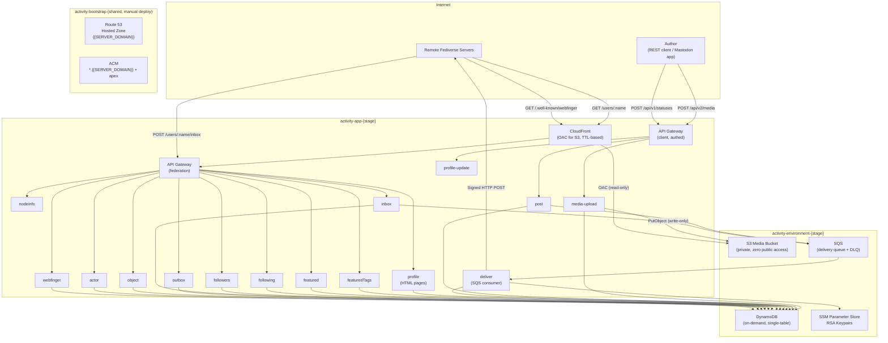
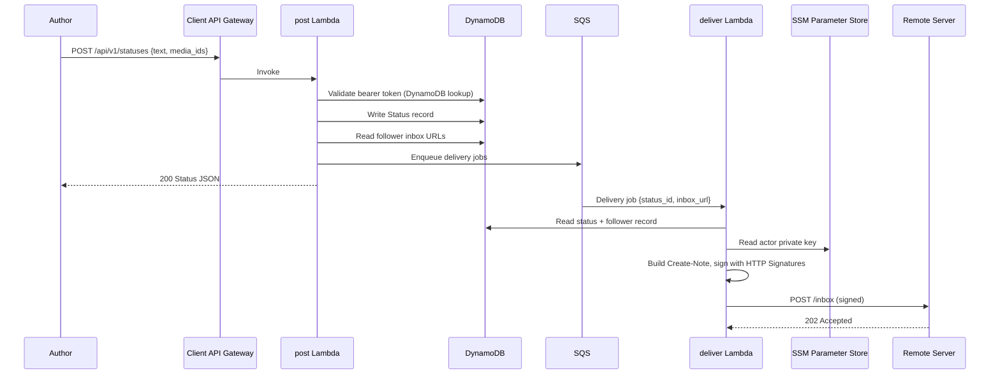
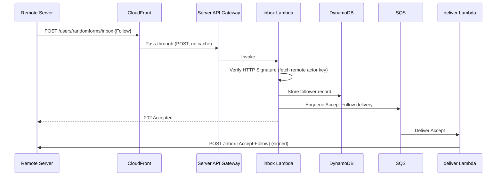
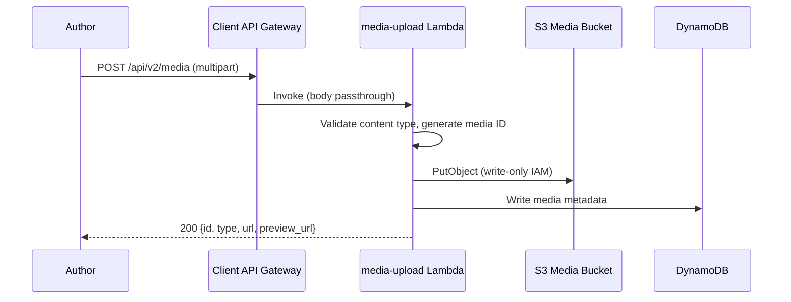

# Architecture Overview

The three-template stack architecture, request flows, and domain consolidation strategy.

## Overview

The server is split into three AWS SAM templates with different lifecycles. This article covers the full architecture with diagrams showing how requests flow through the system.

### Three-Template Stack Architecture

### Request Flow: Posting a Status

When an author posts content through the client API, the bearer token is validated against DynamoDB (with SSM fallback), the status is written to DynamoDB, and delivery jobs are enqueued to SQS for each follower. CloudFront TTLs handle cache expiry automatically -- no invalidation is needed.

### Request Flow: Receiving a Follow

When a remote server sends a Follow activity, the inbox Lambda verifies the HTTP Signature, stores the follower record, and enqueues an Accept delivery.

### Request Flow: Media Upload

Media uploads flow through the Lambda -- the client never gets a presigned URL or direct S3 access. The bucket remains completely dark to the public internet.

### Domain Consolidation

In split DNS mode, the handle domain has its own CloudFront distribution that serves the main website. ActivityPub federation endpoints live at the server domain with a separate CloudFront distribution. WebFinger discovery is delegated from the handle domain to the server domain so that handles resolve correctly. In simple DNS mode, the server domain and handle domain are the same.

The client API (for posting and media uploads) runs on a separate API Gateway domain, not behind CloudFront. This keeps the public-facing CDN purely read-only.

### CloudFront Cache Strategy

The server uses a TTL-based caching strategy. There are no CloudFront invalidations -- cache expiry is handled entirely by TTL values. Federation reads are served from the CloudFront edge with minimal compute cost. Frequently-changing resources use short TTLs, while stable resources use longer ones.

| Path Pattern | TTL | Notes |
|---|---|---|
| `/.well-known/nodeinfo`, `/nodeinfo/*` | 24h | Server metadata, changes rarely |
| `/.well-known/webfinger*` | 24h | Actor discovery |
| `/users/*/outbox*` | 1h | New posts visible within an hour |
| `/users/*/statuses/*` | 1h | Individual posts |
| `/users/*` (actor profile) | 24h | Profile data |
| `/users/*/followers*`, `/users/*/following*` | 1h | Follower/following counts |
| `/users/*/collections/featured`, `/users/*/collections/tags` | 24h | Pinned posts, featured tags |
| `/api/v1/instance`, `/api/v2/instance` | 24h | Instance metadata |
| `/media/*` | 1h | S3 media via OAC (immutable keys) |
| `POST /users/*/inbox` | No cache | Inbound federation (pass-through) |
| `/api/v1/statuses`, `/api/v2/media`, `/api/v1/accounts/*` | No cache | Client API (pass-through) |
| `/auth/*`, `/compose`, `/api/internal/*` | No cache | Session-based endpoints |
