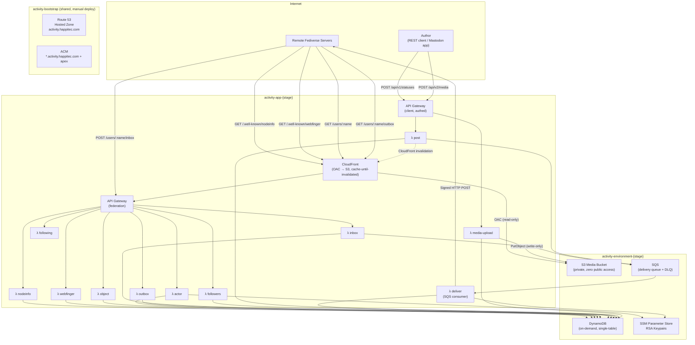
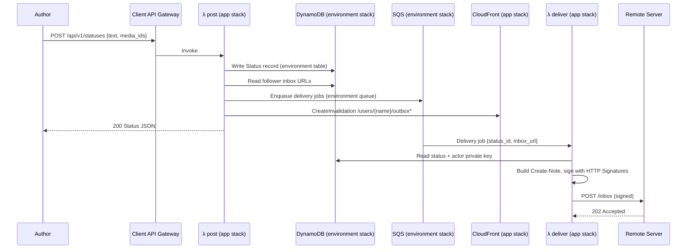
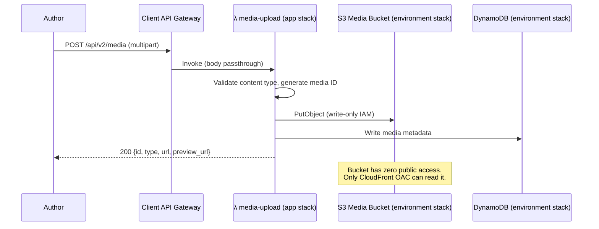
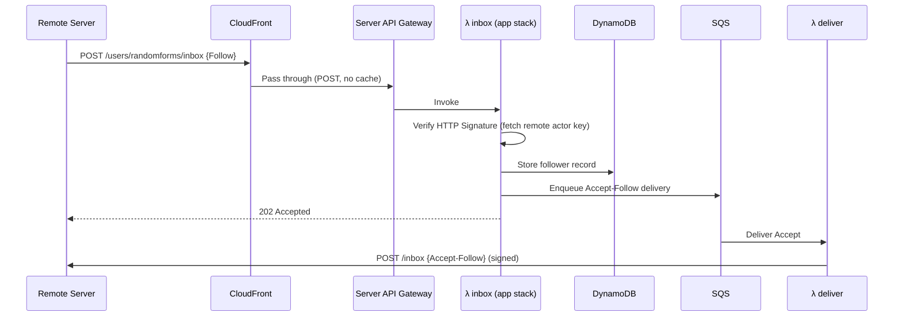

# activity.happitec.com — Project Plan

**Serverless ActivityPub for happitec-inc**

A multi-account ActivityPub server running entirely on AWS serverless infrastructure (Lambda, DynamoDB, SQS, S3, CloudFront). Swift, using `swift-aws-lambda-runtime`. No always-on servers.

## Goals

1. Host ActivityPub accounts for happitec apps (e.g. `@randomforms@happitec.com`, `@wishyouwerehere@happitec.com`)
2. Federate with Mastodon, GoToSocial, Misskey, and other ActivityPub servers
3. Post text, images, and video
4. Accept followers, deliver posts, receive likes/boosts/replies
5. Zero cost at rest — pay only when posting or receiving traffic
6. Mastodon client API compatibility (Ivory, Ice Cubes, Elk) as a stretch goal; simple REST API for posting as MVP

## Non-Goals (for now)

- Full Mastodon feature parity (polls, scheduled posts, bookmarks, filters, etc.)
- Admin/moderation UI
- User registration — accounts are provisioned via config/CLI
- Direct messages
- Relay support
- Full-text search

---

## Three-Template Architecture

Three SAM templates, parameterized by stage. Bootstrap is deployed once. Environment and app templates are reused across prod, stage, and PR environments.



### Stack Responsibilities

#### `activity-bootstrap` (manual deploy, once ever)

Truly shared resources that outlive all environments. Deployed once. The parent `happitec.com` zone needs one NS delegation record pointing to this hosted zone.

| Resource | Purpose |
|----------|---------|
| Route 53 Hosted Zone | `activity.happitec.com` — all env subdomains live here |
| ACM Wildcard Certificate | `activity.happitec.com` + `*.activity.happitec.com` |

**Exports:** `HostedZoneId`, `CertificateArn`

#### `activity-environment-{stage}` (per-env data layer)

Long-lived per-environment data stores and queues. Prod and stage each get their own stack. PR environments share the stage environment stack. You can redeploy the app stack without touching data.

| Resource | Purpose |
|----------|---------|
| S3 Media Bucket | **Private, zero public access.** `BlockPublicAccess: true` on all four settings. No bucket policy by default — OAC policy added by app stack. Lifecycle rules: abort incomplete multipart uploads after 7 days. |
| DynamoDB Table | Single-table design (actors, statuses, followers, activities, media metadata). On-demand billing. **PITR enabled for prod** (point-in-time recovery). |
| SQS Queue + DLQ | Outbound delivery fan-out. Visibility timeout 120s. CloudWatch alarm on DLQ `ApproximateNumberOfMessagesVisible > 0` (SNS notification). |
| SSM Parameter Store (naming convention) | RSA keypairs per actor stored as SecureString parameters under `/activity/{stage}/keys/{username}`. Created by a provisioning CLI — not pre-created in CloudFormation. The environment stack just exports the prefix so Lambdas know where to look. Actor provisioning (key generation + DynamoDB seed) is a CLI operation, not a stack resource. Zero cost (Standard tier SecureString, KMS-encrypted). |

**Imports:** bootstrap exports.
**Exports:** `MediaBucketName`, `MediaBucketArn`, `TableName`, `TableArn`, `QueueUrl`, `QueueArn`, `SSMKeyPrefix`

#### `activity-app-{stage}` (all compute + CDN)

Everything that runs code or serves traffic. Two API Gateways (federation + client), all Lambdas, CloudFront. Deployed by CI on every trigger.

**Federation surface (read path):**

| Resource | Purpose |
|----------|---------|
| CloudFront Distribution | Edge cache + OAC for S3 media. Cache-until-invalidated strategy. |
| CloudFront OAC | Origin Access Control for the environment's S3 media bucket. |
| S3 Bucket Policy | Grants OAC read-only access to the environment's media bucket. |
| API Gateway (REST API) | Federation endpoints (`{stage}.activity.happitec.com`) |
| λ nodeinfo | `GET /.well-known/nodeinfo` + `GET /nodeinfo/2.1` |
| λ webfinger | `GET /.well-known/webfinger` |
| λ actor | `GET /users/{username}` |
| λ inbox | `POST /users/{username}/inbox` (signature verification) |
| λ outbox | `GET /users/{username}/outbox` |
| λ object | `GET /users/{username}/statuses/{id}` |
| λ followers | `GET /users/{username}/followers` |
| λ following | `GET /users/{username}/following` (empty collection) |
| λ deliver | SQS consumer → signed HTTP POST to remote inboxes |

**Client surface (write path):**

| Resource | Purpose |
|----------|---------|
| API Gateway (REST API) | Authed posting endpoints (separate domain, not behind CloudFront) |
| λ post | `POST /api/v1/statuses` — write status, enqueue delivery, invalidate CloudFront |
| λ media-upload | `POST /api/v2/media` — receive upload, PutObject to S3, write metadata to DynamoDB |

**IAM principles:**
- Federation Lambdas: `dynamodb:GetItem`, `dynamodb:Query`, `dynamodb:PutItem` (inbox only), `dynamodb:DeleteItem` (inbox only), `dynamodb:UpdateItem` (inbox — like/boost count increment), `sqs:SendMessage`, `ssm:GetParameter` (with decryption). **Zero S3 permissions** — CloudFront OAC handles media serving.
- Client Lambdas: `dynamodb:PutItem`, `dynamodb:GetItem`, `dynamodb:Query`, `s3:PutObject` (media bucket), `sqs:SendMessage`, `cloudfront:CreateInvalidation`. **No S3 read/delete.**

Media uploads flow **through the Lambda** — the client never gets a presigned URL or direct S3 access. The bucket stays dark.

**Imports:** bootstrap + environment exports.
**Exports:** `CloudFrontDistributionId`, `ServerApiUrl`, `ClientApiUrl`, `ServerDomain`

---

### CloudFront Cache Strategy

Cache-until-invalidated. The `λ post` function fires a CloudFront invalidation when content changes. Between posts, everything is served from the edge at zero compute cost.

| Path Pattern | TTL | Invalidation Trigger | Origin |
|---|---|---|---|
| `/.well-known/nodeinfo`, `/nodeinfo/*` | 24h | Actor create/delete (rare) | API Gateway |
| `/.well-known/webfinger*` | 24h, **cache key includes `resource` query param** | Actor create/delete | API Gateway |
| `/users/*/outbox*` | 365d (effectively indefinite), **cache key includes `page`, `min_id`, `max_id` query params** | New post (`λ post` invalidates) | API Gateway |
| `/users/*/statuses/*` | 365d (effectively indefinite) | Post edit/delete (`λ post` or `λ inbox` invalidates) | API Gateway |
| `/users/*` (GET, no /inbox, /statuses, /outbox, /followers, /following) | 24h | Profile update | API Gateway |
| `/users/*/followers*` | 1h | Follow/unfollow | API Gateway |
| `/media/*` | Immutable (365d, `Cache-Control: immutable`) | Never | S3 via OAC |
| `POST /users/*/inbox` | No cache (POST passthrough) | — | API Gateway |
| `/api/*` | Not on this distribution | — | — |

The client API Gateway is on a **separate domain** — not behind CloudFront. This keeps the public-facing CDN purely read-only.

---

### Request Flow — Posting (across stacks)



### Request Flow — Media Upload



### Request Flow — Receiving a Follow



---

## Environments

Following the PPG pattern. All domains are subdomains of `activity.happitec.com` (one Route 53 hosted zone, one wildcard cert).

| Environment | Trigger | Data Layer | App Stack | Domain |
|-------------|---------|------------|-----------|--------|
| **prod** | GitHub release (v-prefixed tag) | `activity-environment-prod` | `activity-app-prod` | `activity.happitec.com` |
| **stage** | Push to main | `activity-environment-stage` | `activity-app-stage` | `stage.activity.happitec.com` |
| **PR** | PR opened/updated | `activity-environment-stage` (shared) | `activity-app-pr-{n}` | `pr-{n}.activity.happitec.com` |

Three templates: `activity-bootstrap`, `activity-environment`, `activity-app`. Both `activity-environment` and `activity-app` are parameterized by `Stage` — the same template is used for prod, stage, and PR environments. CI workflows share the templates with different parameter values.

Bootstrap is deployed once manually. Environment stacks are deployed manually for prod and stage (long-lived). PR environments share the stage environment stack. App stacks are deployed by CI on every trigger.

**Dependency chain:** `activity-bootstrap` → `activity-environment-{stage}` → `activity-app-{stage}`

---

## DynamoDB Schema

Single-table design. Partition key `PK`, sort key `SK`. GSI1 for reverse lookups.

| Entity | PK | SK | Attributes |
|--------|----|----|------------|
| Actor | `ACTOR#{username}` | `PROFILE` | displayName, summary, avatarUrl, headerUrl, publicKeyPem, privateKeyArn, createdAt, discoverable, manuallyApprovesFollowers, followerCount, followingCount, statusCount |
| Status | `ACTOR#{username}` | `STATUS#{ulid}` | content, contentWarning, visibility, attachments[] (denormalized: includes CloudFront URL, contentType, description, blurhash per attachment — avoids N+1 media fetches on outbox reads), inReplyTo, published, sensitive, language, to[], cc[], likesCount, boostsCount, repliesCount |
| Follower | `ACTOR#{username}` | `FOLLOWER#{actorUri}` | inboxUrl, sharedInboxUrl, followActivityId, acceptedAt |
| Received Activity | `ACTOR#{username}` | `ACTIVITY#{type}#{ulid}` | actorUri, type, objectUri, raw, receivedAt |
| Media | `MEDIA#{id}` | `META` | s3Key, contentType, blurhash, description, width, height, size |
| Remote Actor (cache) | `REMOTE_ACTOR#{actorUri}` | `PROFILE` | publicKeyPem, preferredUsername, inbox, sharedInbox, fetchedAt, ttl (DynamoDB TTL, 24h) |
| Following | `ACTOR#{username}` | `FOLLOWING#{actorUri}` | followActivityId, acceptedAt (reserved — brand accounts don't follow anyone initially, but schema supports it for future use) |
| Tombstone | `TOMBSTONE#{objectUri}` | `META` | deletedAt, ttl (DynamoDB TTL, 30d) |

**GSI1** (for outbox pagination, follower listing):
- GSI1PK: `ACTOR#{username}`, GSI1SK: `PUBLISHED#{iso8601}` (statuses)
- GSI1PK: `FOLLOWERS#{username}`, GSI1SK: `{acceptedAt}` (followers)

**Important:** GSI1PK/GSI1SK are not automatically derived — they must be explicitly written as attributes on each record at insert time. Follower records need `GSI1PK: FOLLOWERS#{username}` and `GSI1SK: {acceptedAt}`. Status records need `GSI1PK: ACTOR#{username}` and `GSI1SK: PUBLISHED#{iso8601}`.

**Note on outbox query:** Since `STATUS#{ulid}` sort keys are already time-ordered, outbox pagination *could* use a base-table query (`SK begins_with STATUS#`, `ScanIndexForward=false`) instead of GSI1. GSI1 adds write cost but provides a cleaner separation. Keep GSI1 for now — revisit if write costs matter.

**Reply threading:** Currently no GSI for "all replies to status X." For reply count, denormalize `repliesCount` on the parent status (atomic `UpdateItem` on Create-Note replies). For full thread retrieval (Phase 5+), consider GSI2 on `inReplyTo` or a batch query pattern.

---

## Lambda Functions

All Swift, using `swift-aws-lambda-runtime` with API Gateway REST API event type. No Vapor — each function is a standalone handler.

### App Stack — Federation Endpoints

#### `webfinger` — `GET /.well-known/webfinger`

Resolves `?resource=acct:username@happitec.com` to the actor URI. The response's `links` array must include `rel: "self"` with `type: "application/activity+json"` and `href` pointing to the actor URL — this is the critical link Mastodon uses for discovery.

#### `actor` — `GET /users/{username}`

Returns the ActivityPub Actor document (JSON-LD) including public key. Content-negotiates: responds with `application/activity+json` by default, but also accepts `application/ld+json; profile="https://www.w3.org/ns/activitystreams"` (some servers use this form).

Response (Content-Type: `application/activity+json`):
```json
{
  "@context": [
    "https://www.w3.org/ns/activitystreams",
    "https://w3id.org/security/v1"
  ],
  "id": "https://activity.happitec.com/users/randomforms",
  "type": "Service",
  "preferredUsername": "randomforms",
  "name": "Random Forms",
  "summary": "Generative art for iOS",
  "inbox": "https://activity.happitec.com/users/randomforms/inbox",
  "outbox": "https://activity.happitec.com/users/randomforms/outbox",
  "followers": "https://activity.happitec.com/users/randomforms/followers",
  "following": "https://activity.happitec.com/users/randomforms/following",
  "url": "https://activity.happitec.com/@randomforms",
  "icon": {
    "type": "Image",
    "url": "https://activity.happitec.com/media/avatars/randomforms.png"
  },
  "publicKey": {
    "id": "https://activity.happitec.com/users/randomforms#main-key",
    "owner": "https://activity.happitec.com/users/randomforms",
    "publicKeyPem": "-----BEGIN PUBLIC KEY-----\n...\n-----END PUBLIC KEY-----"
  },
  "discoverable": true,
  "manuallyApprovesFollowers": false
}
```

Note: `type: "Service"` signals to other servers that this is a bot/service account, not a human. This is correct for app brand accounts.

Note: `manuallyApprovesFollowers: false` means all Follow requests are auto-accepted. If set to `true`, inbox would need to store pending follows and expose an approval API — out of scope for MVP. Hardcode `false` in Phase 2; revisit if we need approval flows later.

#### `inbox` — `POST /users/{username}/inbox`

Receives activities from remote servers. Must verify HTTP Signatures.

**HTTP Signature verification (Cavage draft-12):** Requires fetching the remote actor's public key via their `publicKey.id` URL. To avoid a round-trip on every request, cache fetched actor documents in DynamoDB with a 24h TTL (entity: `REMOTE_ACTOR#{actorUri}`, SK: `PROFILE`). Refresh on signature verification failure (key rotation).

**`Digest` header:** Inbound POST requests must include `Digest: SHA-256=<base64(sha256(body))>`. The inbox handler must validate the Digest matches the body *and* confirm that `digest` is listed in the signature's `headers` parameter. Outbound deliveries from `λ deliver` must likewise include a valid Digest header in their signed requests — Mastodon rejects deliveries without it.

**`Date` header staleness:** Reject inbound requests where the `Date` header is more than 60 seconds old (Mastodon enforces this). Protects against replay attacks.

**Activity idempotency:** Remote servers retry failed deliveries. The same `Follow` or `Like` with the same `id` can arrive multiple times. Deduplicate by activity `id` using a DynamoDB conditional write (`attribute_not_exists(PK)`) before processing. Without this, retry storms create duplicate followers or double-counted likes.

**`object` field type variance:** For `Undo`, `Like`, and `Announce`, the `object` field may be a URI string *or* an inline object depending on the sending server. The inbox handler must handle both forms.

Supported activities:
- `Follow` → store follower, enqueue `Accept` delivery
- `Accept` → record that a follow request was accepted (forward compat for when we follow others)
- `Undo` → if undoing `Follow`, remove follower. If undoing `Like`/`Announce`, decrement counts via `UpdateItem`.
- `Like` → store, increment count via `UpdateItem` (atomic, handles concurrent likes)
- `Announce` (boost) → store, increment count via `UpdateItem`
- `Create` (Note, in reply) → store as reply
- `Delete` → remove stored reply/activity, return 410 Gone for the deleted object's URI on subsequent fetches (tombstone record in DynamoDB with TTL)
- `Update` → update cached remote actor document
- **Unrecognized types** → log and return 202 (forward compatibility — never reject unknown activity types)

#### `object` — `GET /users/{username}/statuses/{id}`

Object resolution endpoint. Remote servers fetch Note objects directly by URI (e.g. for reply threading, link previews, quoting). Returns the `Note` JSON-LD document. Returns 410 Gone if a tombstone exists for the object. Served through CloudFront (cache-until-invalidated on post edit/delete).

#### `outbox` — `GET /users/{username}/outbox`

Returns an OrderedCollection of the actor's public statuses, paginated.

#### `deliver` — SQS consumer

Reads delivery jobs, constructs signed ActivityPub activities, POSTs to remote inboxes. Handles retries via SQS visibility timeout + DLQ for persistent failures. Set `maxReceiveCount: 3` on the DLQ redrive policy.

**Shared inbox coalescing:** When multiple followers are on the same server (e.g. mastodon.social), deliver one copy to that server's `sharedInboxUrl` instead of N individual copies. The `λ post` handler should group follower inboxes by shared inbox URL when enqueuing delivery jobs, producing one SQS message per unique shared inbox. This is practically required — without it, a post to an account with 500 mastodon.social followers sends 500 identical HTTP requests.

#### `followers` — `GET /users/{username}/followers`

Returns an OrderedCollection of follower actor URIs, paginated. Uses GSI1 with `FOLLOWERS#{username}` partition key, ordered by `acceptedAt`. Serves follower count in the collection's `totalItems` (cached in the actor profile record, updated atomically on follow/unfollow via `UpdateItem`).

#### `nodeinfo` — `GET /.well-known/nodeinfo` + `GET /nodeinfo/2.1`

Two-step discovery: `/.well-known/nodeinfo` returns a link to `/nodeinfo/2.1`, which returns server metadata (software name/version, protocols, user/post counts, open registrations: false). Mastodon 4.x and GoToSocial query this for federation health. Can be a single Lambda or folded into the WebFinger handler. Mostly static — heavy CloudFront caching (24h+).

#### `following` — `GET /users/{username}/following`

Returns an empty `OrderedCollection` with `totalItems: 0`. Brand/service accounts don't follow other accounts. Required by the ActivityPub spec — Mastodon flags profiles as incomplete without it.

### App Stack — Client/Posting Endpoints

#### `post` — `POST /api/v1/statuses`

Create a new status. Writes to DynamoDB (environment table), atomically increments `statusCount` on the actor profile via `UpdateItem`, fans out delivery jobs to SQS (environment queue), fires CloudFront invalidation for outbox.

**Critical: `to`/`cc` addressing on Create activities.** Every outbound `Create` activity and its embedded `Note` must include:
```json
"to": ["https://www.w3.org/ns/activitystreams#Public"],
"cc": ["https://activity.happitec.com/users/randomforms/followers"]
```
Without these, Mastodon and most servers will **not display the post in followers' timelines** — it's a silent failure where delivery succeeds (202) but the post is invisible.

The `Note` must also include `"attributedTo": "https://activity.happitec.com/users/{username}"`.

Outbox items must be `Create` wrapper activities (not bare `Note` objects):
```json
{"type": "Create", "actor": "...", "object": {...Note...}, "to": [...], "cc": [...]}
```

Auth: Bearer token (simple shared secret per actor for MVP).

#### `media-upload` — `POST /api/v2/media`

Receives multipart upload, writes to S3 (environment bucket), stores metadata in DynamoDB (environment table). Returns media ID for attachment to statuses.

Media flows through the Lambda — no presigned URLs, no direct S3 access from outside AWS. **API Gateway payload limit is 6MB**, which covers most images but not high-res photos or video. See Open Question #4 for the video/large-file strategy.

---

## OpenAPI Schema

```yaml
openapi: 3.1.0
info:
  title: activity.happitec.com
  description: Serverless ActivityPub server for happitec-inc
  version: 0.1.0
  license:
    name: MIT

servers:
  - url: https://activity.happitec.com
    description: Production (federation)
  - url: https://stage.activity.happitec.com
    description: Stage (federation)
  - url: https://client.activity.happitec.com
    description: Production (client)
  - url: https://client-stage.activity.happitec.com
    description: Stage (client)

paths:
  # ── App Stack — Federation ──────────────────────────

  /.well-known/nodeinfo:
    get:
      operationId: nodeInfoDiscovery
      summary: NodeInfo discovery document
      tags: [federation]
      description: |
        Returns a JRD with a link to `/nodeinfo/2.1`. Mastodon 4.x and GoToSocial
        query this for federation health checks. Served from CloudFront cache (24h).
      responses:
        "200":
          description: NodeInfo discovery links
          content:
            application/json:
              schema:
                type: object
                properties:
                  links:
                    type: array
                    items:
                      type: object
                      properties:
                        rel:
                          type: string
                          example: "http://nodeinfo.diaspora.software/ns/schema/2.1"
                        href:
                          type: string
                          format: uri
                          example: "https://activity.happitec.com/nodeinfo/2.1"

  /nodeinfo/2.1:
    get:
      operationId: nodeInfo
      summary: NodeInfo 2.1 server metadata
      tags: [federation]
      description: |
        Server metadata: software name/version, protocols, user/status counts,
        open registrations (false). Mostly static. Served from CloudFront cache (24h).
      responses:
        "200":
          description: NodeInfo 2.1 document
          content:
            application/json:
              schema:
                type: object
                properties:
                  version:
                    type: string
                    example: "2.1"
                  software:
                    type: object
                    properties:
                      name:
                        type: string
                        example: "activity-happitec"
                      version:
                        type: string
                  protocols:
                    type: array
                    items:
                      type: string
                    example: ["activitypub"]
                  usage:
                    type: object
                    properties:
                      users:
                        type: object
                        properties:
                          total:
                            type: integer
                          activeMonth:
                            type: integer
                      localPosts:
                        type: integer
                  openRegistrations:
                    type: boolean
                    example: false

  /.well-known/webfinger:
    get:
      operationId: webfinger
      summary: WebFinger resource discovery
      tags: [federation]
      description: |
        Resolves an `acct:` URI to an ActivityPub actor.
        Required for Mastodon federation compatibility.
        Served from CloudFront cache (24h TTL).
      parameters:
        - name: resource
          in: query
          required: true
          schema:
            type: string
            example: "acct:randomforms@happitec.com"
      responses:
        "200":
          description: WebFinger JRD response
          content:
            application/jrd+json:
              schema:
                $ref: "#/components/schemas/WebFingerResponse"
        "404":
          description: Unknown resource

  /users/{username}:
    get:
      operationId: getActor
      summary: Fetch ActivityPub actor profile
      tags: [federation]
      parameters:
        - $ref: "#/components/parameters/username"
      responses:
        "200":
          description: Actor document (JSON-LD)
          content:
            application/activity+json:
              schema:
                $ref: "#/components/schemas/Actor"
        "404":
          description: Unknown actor

  /users/{username}/statuses/{id}:
    get:
      operationId: getObject
      summary: Fetch a single status/Note by ID
      tags: [federation]
      description: |
        Object resolution endpoint. Remote servers fetch Note objects by URI
        for reply threading, link previews, and quoting. Returns 410 if deleted (tombstone).
      parameters:
        - $ref: "#/components/parameters/username"
        - name: id
          in: path
          required: true
          schema:
            type: string
      responses:
        "200":
          description: Note object (JSON-LD)
          content:
            application/activity+json:
              schema:
                $ref: "#/components/schemas/Activity"
        "404":
          description: Unknown status
        "410":
          description: Status was deleted (tombstone)

  /users/{username}/inbox:
    post:
      operationId: receiveActivity
      summary: Receive an ActivityPub activity
      tags: [federation]
      description: |
        Federation inbox. Receives Follow, Undo, Like, Announce,
        Create (replies), Delete, and Update activities.
        Requires valid HTTP Signature.
      parameters:
        - $ref: "#/components/parameters/username"
      requestBody:
        required: true
        content:
          application/activity+json:
            schema:
              $ref: "#/components/schemas/Activity"
          application/ld+json:
            schema:
              $ref: "#/components/schemas/Activity"
      responses:
        "202":
          description: Activity accepted
        "401":
          description: Invalid or missing HTTP Signature
        "404":
          description: Unknown actor

  /users/{username}/outbox:
    get:
      operationId: getOutbox
      summary: Fetch public statuses
      tags: [federation]
      description: |
        Returns an OrderedCollection of the actor's public posts, newest first.
        Served from CloudFront cache; invalidated on new post.
      parameters:
        - $ref: "#/components/parameters/username"
        - name: page
          in: query
          schema:
            type: boolean
        - name: min_id
          in: query
          schema:
            type: string
        - name: max_id
          in: query
          schema:
            type: string
      responses:
        "200":
          description: Ordered collection of activities
          content:
            application/activity+json:
              schema:
                $ref: "#/components/schemas/OrderedCollection"

  /users/{username}/followers:
    get:
      operationId: getFollowers
      summary: Fetch follower collection
      tags: [federation]
      parameters:
        - $ref: "#/components/parameters/username"
      responses:
        "200":
          description: Ordered collection of follower URIs
          content:
            application/activity+json:
              schema:
                $ref: "#/components/schemas/OrderedCollection"

  /users/{username}/following:
    get:
      operationId: getFollowing
      summary: Fetch following collection
      tags: [federation]
      description: Returns an empty OrderedCollection. Brand accounts don't follow others.
      parameters:
        - $ref: "#/components/parameters/username"
      responses:
        "200":
          description: Ordered collection (always empty for service accounts)
          content:
            application/activity+json:
              schema:
                $ref: "#/components/schemas/OrderedCollection"

  # ── App Stack — Client (authoring) ───────────────────────────

  /api/v1/statuses:
    post:
      operationId: createStatus
      summary: Post a new status
      tags: [client]
      description: |
        Creates a status and fans out delivery to all followers.
        Auth required. Mastodon-compatible subset of POST /api/v1/statuses.
        Fires CloudFront invalidation for outbox on success.
      security:
        - bearerAuth: []
      requestBody:
        required: true
        content:
          application/json:
            schema:
              $ref: "#/components/schemas/CreateStatusRequest"
          application/x-www-form-urlencoded:
            schema:
              $ref: "#/components/schemas/CreateStatusRequest"
      responses:
        "200":
          description: Status created
          content:
            application/json:
              schema:
                $ref: "#/components/schemas/Status"
        "401":
          description: Invalid or missing auth
        "422":
          description: Validation error

  /api/v2/media:
    post:
      operationId: uploadMedia
      summary: Upload media attachment
      tags: [client]
      description: |
        Upload an image or video. Media flows through the Lambda to S3 —
        no presigned URLs, no direct bucket access.
        Returns a media ID for use in createStatus.
      security:
        - bearerAuth: []
      requestBody:
        required: true
        content:
          multipart/form-data:
            schema:
              type: object
              properties:
                file:
                  type: string
                  format: binary
                  description: The media file
                description:
                  type: string
                  description: Alt text
                focus:
                  type: string
                  description: "Focal point as x,y (-1.0 to 1.0)"
      responses:
        "200":
          description: Media attachment created
          content:
            application/json:
              schema:
                $ref: "#/components/schemas/MediaAttachment"
        "401":
          description: Invalid or missing auth
        "413":
          description: File too large
        "422":
          description: Unsupported media type

components:
  securitySchemes:
    bearerAuth:
      type: http
      scheme: bearer
      description: |
        Bearer token. MVP uses per-actor shared secret stored in
        SSM Parameter Store. OAuth2 planned for Mastodon client compat (Phase 6).

  parameters:
    username:
      name: username
      in: path
      required: true
      schema:
        type: string
        example: randomforms

  schemas:
    WebFingerResponse:
      type: object
      properties:
        subject:
          type: string
          example: "acct:randomforms@happitec.com"
        aliases:
          type: array
          items:
            type: string
        links:
          type: array
          items:
            type: object
            properties:
              rel:
                type: string
              type:
                type: string
              href:
                type: string

    Actor:
      type: object
      description: ActivityPub Actor (Person or Service)
      properties:
        "@context":
          oneOf:
            - type: string
            - type: array
        id:
          type: string
          format: uri
        type:
          type: string
          enum: [Person, Service]
        preferredUsername:
          type: string
        name:
          type: string
        summary:
          type: string
        inbox:
          type: string
          format: uri
        outbox:
          type: string
          format: uri
        followers:
          type: string
          format: uri
        url:
          type: string
          format: uri
        icon:
          type: object
          properties:
            type:
              type: string
            url:
              type: string
              format: uri
        publicKey:
          type: object
          properties:
            id:
              type: string
            owner:
              type: string
            publicKeyPem:
              type: string
        discoverable:
          type: boolean
        manuallyApprovesFollowers:
          type: boolean

    Activity:
      type: object
      description: Generic ActivityPub activity envelope
      properties:
        "@context":
          oneOf:
            - type: string
            - type: array
        id:
          type: string
          format: uri
        type:
          type: string
          description: "Activity type: Follow, Undo, Like, Announce, Create, Delete, Update"
        actor:
          type: string
          format: uri
        object:
          description: The object of the activity (URI or inline object)
          oneOf:
            - type: string
            - type: object

    OrderedCollection:
      type: object
      properties:
        "@context":
          type: string
        id:
          type: string
          format: uri
        type:
          type: string
          enum: [OrderedCollection, OrderedCollectionPage]
        totalItems:
          type: integer
        first:
          type: string
          format: uri
        last:
          type: string
          format: uri
        orderedItems:
          type: array
          items:
            $ref: "#/components/schemas/Activity"
        next:
          type: string
          format: uri
        prev:
          type: string
          format: uri

    CreateStatusRequest:
      type: object
      properties:
        status:
          type: string
          description: Text content of the status (HTML or plain text)
        media_ids:
          type: array
          items:
            type: string
          description: Media attachment IDs from /api/v2/media
        sensitive:
          type: boolean
          default: false
        spoiler_text:
          type: string
          description: Content warning text
        visibility:
          type: string
          enum: [public, unlisted]
          default: public
        language:
          type: string
          description: ISO 639-1 language code
          example: en
        in_reply_to_id:
          type: string
          description: ID of status being replied to
        quote_id:
          type: string
          description: |
            ID of status being quoted. On the ActivityPub side, the Note includes
            `quoteUrl` pointing to the quoted Note's URI. Mastodon 4.3+ renders this
            as an inline quote. FEP-e232 is the emerging standard; we also emit a
            `tag` entry with `type: Link` for broader compatibility.

    Status:
      type: object
      description: Mastodon-compatible status entity (subset)
      properties:
        id:
          type: string
        created_at:
          type: string
          format: date-time
        content:
          type: string
        visibility:
          type: string
        sensitive:
          type: boolean
        spoiler_text:
          type: string
        language:
          type: string
        uri:
          type: string
          format: uri
        url:
          type: string
          format: uri
        replies_count:
          type: integer
        reblogs_count:
          type: integer
        favourites_count:
          type: integer
        account:
          type: object
          description: Actor who posted
        media_attachments:
          type: array
          items:
            $ref: "#/components/schemas/MediaAttachment"

    MediaAttachment:
      type: object
      properties:
        id:
          type: string
        type:
          type: string
          enum: [image, video, gifv, audio, unknown]
        url:
          type: string
          format: uri
        preview_url:
          type: string
          format: uri
        description:
          type: string
        blurhash:
          type: string
        meta:
          type: object
          properties:
            width:
              type: integer
            height:
              type: integer
            size:
              type: string
```

---

## SAM Template Structure

Three templates, reused across environments:

### `activity-bootstrap/template.yaml`

```
Parameters: DomainName (default: activity.happitec.com)
Resources:
  HostedZone (Route 53, activity.happitec.com)
  WildcardCertificate (ACM, activity.happitec.com + *.activity.happitec.com)
Outputs:
  HostedZoneId, CertificateArn
```

### `activity-environment/template.yaml`

```
Parameters: Stage, BootstrapStackName
Resources:
  MediaBucket (S3):
    - BucketName: activity-media-{stage}
    - BucketEncryption: AES256
    - PublicAccessBlockConfiguration: all four = true
    - No bucket policy (OAC is added by app stack)
  ActorsTable (DynamoDB, on-demand, single-table)
  DeliveryQueue (SQS, visibility timeout 120s)
  DeliveryDLQ (SQS)
  # SSM Parameter Store keys are NOT CloudFormation resources — they're created by the provisioning CLI.
  # The template just exports the naming prefix so Lambdas know where to look.
Outputs:
  MediaBucketName, MediaBucketArn,
  TableName, TableArn,
  QueueUrl, QueueArn,
  SSMKeyPrefix
```

### `activity-app/template.yaml`

```
Parameters: Stage, BootstrapStackName, EnvironmentStackName
Globals:
  Function: Runtime custom.al2023, MemorySize 512, Timeout 30, Architectures arm64
Resources:
  # ── Federation (read path) ──────────────
  # ── DNS + Domain Setup ──────────────
  ServerDomainName (API Gateway custom domain for federation API):
    - DomainName: {stage}.activity.happitec.com (prod: activity.happitec.com)
    - CertificateArn: from bootstrap
    - BasePathMapping to ServerApi stage
  ClientDomainName (API Gateway custom domain for client API):
    - DomainName: client-{stage}.activity.happitec.com (prod: client.activity.happitec.com)
    - CertificateArn: from bootstrap
    - BasePathMapping to ClientApi stage
  FederationDnsRecord (Route 53 alias → CloudFront distribution)
  ClientDnsRecord (Route 53 alias → ClientDomainName regional domain)

  # ── CloudFront + Federation ────────
  CloudFrontDistribution:
    Origins:
      - ServerDomainName (custom domain, avoids stage-prefix stripping issues)
      - S3 (media, via OAC — read-only, references environment bucket)
    CacheBehaviors:
      - /.well-known/nodeinfo: TTL 24h
      - /nodeinfo/*: TTL 24h
      - /.well-known/webfinger: TTL 24h, cache key includes `resource` query string parameter (CloudFront CachePolicy with QueryStringsConfig whitelist)
      - /users/*/outbox*: TTL 365d (invalidated on post), cache key includes `page`, `min_id`, `max_id` query params
      - /users/*/statuses/*: TTL 365d (invalidated on edit/delete)
      - /users/*/followers*: TTL 1h
      - /users/*: TTL 24h (actor profiles, catch-all for GET)
      - /media/*: TTL 365d, Cache-Control immutable
    DefaultCacheBehavior: no cache (POST passthrough)
  CloudFrontOAC (Origin Access Control for S3)
  MediaBucketPolicy (allow OAC read-only — references environment bucket)
  ServerApi (API Gateway REST API):
    Routes:
      - GET /.well-known/nodeinfo → NodeInfoFunction
      - GET /nodeinfo/2.1 → NodeInfoFunction
      - GET /.well-known/webfinger → WebFingerFunction
      - GET /users/{username} → ActorFunction
      - POST /users/{username}/inbox → InboxFunction
      - GET /users/{username}/outbox → OutboxFunction
      - GET /users/{username}/statuses/{id} → ObjectFunction
      - GET /users/{username}/followers → FollowersFunction
      - GET /users/{username}/following → FollowingFunction
  NodeInfoFunction, WebFingerFunction, ActorFunction, ObjectFunction, InboxFunction, OutboxFunction, FollowersFunction, FollowingFunction
  DeliverFunction:
    Timeout: 60 (outbound HTTP to remote servers can be slow)
    ReservedConcurrentExecutions: 5 (prevent runaway fan-out)
    Policies:
      - DynamoDB: GetItem, Query (environment table — read status + actor + follower data)
      - SSM: GetParameter with decryption (environment keys — actor private key for HTTP Signatures)
      - SQS: ReceiveMessage, DeleteMessage, GetQueueAttributes (environment queue — implicit via SAM Events, but explicit for clarity)
  InboxFunction:
    Policies:
      - DynamoDB: GetItem, PutItem, DeleteItem, UpdateItem, Query (environment table)
      - SQS: SendMessage (environment queue)
      - SSM: GetParameter with decryption (environment keys — for signature verification key cache refresh)
      - CloudFront: CreateInvalidation (own distribution — for Delete activity cache busting)

  # ── Client (write path) ────────────────
  ClientApi (API Gateway REST API, separate domain):
    Routes:
      - POST /api/v1/statuses → PostFunction
      - POST /api/v2/media → MediaUploadFunction
  PostFunction:
    Timeout: 60
    Policies:
      - DynamoDB: PutItem, GetItem, Query (environment table)
      - SQS: SendMessage (environment queue)
      - CloudFront: CreateInvalidation (own distribution)
      - SSM: GetParameter with decryption (environment keys)
  MediaUploadFunction:
    Timeout: 60
    Policies:
      - S3: PutObject only (environment media bucket)
      - DynamoDB: PutItem (environment table, media metadata)
Outputs:
  CloudFrontDistributionId, ServerApiUrl, ClientApiUrl, ServerDomain
```

---

## Swift Package Structure

```
Package.swift (swift-tools-version: 6.0)
├── Sources/
│   ├── ActivityPubCore/              # Shared library (all stacks)
│   │   ├── Models/
│   │   │   ├── Actor.swift
│   │   │   ├── Activity.swift
│   │   │   ├── Note.swift
│   │   │   ├── OrderedCollection.swift
│   │   │   └── WebFingerResponse.swift
│   │   ├── Crypto/
│   │   │   ├── HTTPSignature.swift      # Sign + verify (RSA-SHA256)
│   │   │   └── KeyManager.swift         # SSM Parameter Store integration
│   │   ├── Storage/
│   │   │   ├── DynamoDBStore.swift
│   │   │   └── S3MediaStore.swift
│   │   └── Delivery/
│   │       └── ActivityDelivery.swift    # Build + sign + POST
│   │
│   ├── NodeInfoHandler/              # App stack — federation (/.well-known/nodeinfo + /nodeinfo/2.1)
│   ├── WebFingerHandler/             # App stack — federation
│   ├── ActorHandler/                 # App stack — federation
│   ├── ObjectHandler/                # App stack — federation (single status fetch)
│   ├── InboxHandler/                 # App stack — federation
│   ├── OutboxHandler/                # App stack — federation
│   ├── FollowersHandler/            # App stack — federation
│   ├── FollowingHandler/            # App stack — federation (returns empty collection)
│   ├── DeliverHandler/              # App stack — federation (SQS consumer)
│   ├── PostHandler/                  # App stack — client
│   └── MediaUploadHandler/           # App stack — client
│
├── Tests/
│   └── ActivityPubCoreTests/
│       ├── HTTPSignatureTests.swift
│       ├── ActivitySerializationTests.swift
│       └── WebFingerTests.swift
│
├── activity-bootstrap/
│   └── template.yaml
├── activity-environment/
│   └── template.yaml
├── activity-app/
│   └── template.yaml
├── samconfig.toml
└── Makefile                          # Build + package for Lambda
```

---

## Dependencies

| Package | Use |
|---------|-----|
| `swift-aws-lambda-runtime` | Lambda handler framework |
| `swift-aws-lambda-events` | API Gateway REST API (`APIGatewayRequest`/`APIGatewayResponse`) + SQS event types |
| `soto` (or `aws-sdk-swift`) | DynamoDB, S3, SQS, SSM, CloudFront |
| `swift-crypto` | RSA-SHA256 signing/verification |
| `swift-docc-plugin` | Documentation |

No Vapor, no Hummingbird, no HTTP framework. Each Lambda is a standalone handler.

**Reference implementation:** The [APIGatewayV1 example](https://github.com/awslabs/swift-aws-lambda-runtime/tree/main/Examples/APIGatewayV1) in `swift-aws-lambda-runtime` demonstrates the exact pattern — REST API Gateway + SAM + `APIGatewayRequest`/`APIGatewayResponse`.

**Build toolchain:** Cross-compiling Swift for Lambda ARM64 requires either:
- **Docker-based builds** using the official `swift:6.0-amazonlinux2023` image (recommended — matches the Lambda runtime exactly)
- **Swift SDK for cross-compilation** (newer, less battle-tested)

The `Makefile` should produce a flat binary + `bootstrap` symlink per handler, zipped for SAM deployment. This is non-trivial first-time setup — see Phase 0.

---

## Implementation Phases

### Phase 0 — Hardcoded federation smoke test
- **BLOCKER: Resolve Open Question #1 (handle domain) before starting.** If handles are `@name@happitec.com`, WebFinger must be served at `happitec.com/.well-known/webfinger` — this changes what gets deployed in Phase 0. Once federated, handles are permanent.
- Set up the Swift cross-compilation toolchain for Lambda ARM64 (Docker-based build using the official Swift Amazon Linux 2023 image, or Swift SDK for cross-compilation). This is non-trivial setup — budget time for it.
- Deploy `activity-bootstrap` (Route 53 hosted zone, ACM wildcard cert)
- Add NS delegation record in parent `happitec.com` zone
- Deploy a single Lambda behind API Gateway that returns hardcoded WebFinger + Actor JSON — no DynamoDB, no S3, no CloudFront
- Verify Mastodon can discover and display the profile
- **Milestone:** `@randomforms@happitec.com` resolves in Mastodon search (even if the profile is static/empty)

### Phase 1a — Data layer + dynamic actor
- Deploy `activity-environment-stage` (S3 bucket, DynamoDB, SQS)
- Build and run **actor provisioning CLI** (generate RSA keypair → SSM Parameter Store SecureString, seed DynamoDB actor record)
- Deploy `activity-app-stage` with dynamic webfinger, actor, NodeInfo, empty outbox/followers/following — direct API Gateway URLs (no CloudFront yet)
- Seed a test actor via the provisioning CLI
- **Milestone:** `@randomforms@happitec.com` serves live profile data from DynamoDB

### Phase 1b — CloudFront + custom domains
- Add CloudFront distribution with OAC, WebFinger cache policy (whitelist `resource` query param), all cache behaviors
- Add API Gateway custom domains + Route 53 alias records
- **Milestone:** `activity.happitec.com` resolves with full caching, public domain works

### Phase 2 — Accept followers
- Inbox handler: verify HTTP Signatures, handle Follow
- Deliver handler: send signed Accept-Follow
- **Milestone:** A Mastodon account can follow `@randomforms` and see it in their following list

### Phase 3 — Posting + delivery
- Add client API Gateway + post/media Lambdas to app stack
- Create Note → write to DynamoDB → fan out to SQS → signed delivery
- **Critical:** `to`/`cc` addressing on Create activities, `attributedTo` on Notes, `Digest` header on signed POST requests. All three are required — without them, delivery succeeds (202) but posts are invisible in timelines.
- Outbox items must be `Create` wrapper activities (not bare Notes)
- CloudFront invalidation on post
- **Milestone:** Post appears in followers' timelines

### Phase 4 — Media
- Media-upload handler → S3 PutObject → metadata in DynamoDB
- Attach to statuses as ActivityPub `attachment` objects
- CloudFront OAC serving
- **Milestone:** Posts with images federate correctly

### Phase 5 — Interactions
- Inbox: receive and store likes, boosts, replies
- Inbox: handle `Update` for Note objects (federated post edits — separate code path from actor `Update`)
- Expose counts in outbox
- Activity idempotency (deduplicate by activity `id` on retry storms)
- **Milestone:** Full two-way federation for supported activity types

### Phase 6 (stretch) — Mastodon client API
- OAuth2 token flow (added to app stack's client API)
- Expanded REST API for client compatibility
- **Milestone:** Post from Ivory or Ice Cubes

---

## Open Questions

1. **Handle domain:** Handles as `@name@happitec.com` requires WebFinger on `happitec.com/.well-known/webfinger`, which means either deploying to `happitec.com` or setting up a redirect/proxy from `happitec.com` to `activity.happitec.com`. The server lives at `activity.happitec.com` either way. Once federated, handles are permanent — this decision is irreversible.

2. **Auth model for posting:** Simple bearer token per actor (fast to build, stored in SSM Parameter Store) vs. OAuth2 from day one (needed for Mastodon client apps). Bearer token MVP means Phase 6 requires migration.

3. **`everyplace.social`:** Separate deployment or multi-domain support in the same infra? Same code, different bootstrap stack + config. ActivityPub ties actors to domains permanently, so this is also irreversible.

4. **Video handling:** Lambda payload limit is 6MB (API Gateway) / 10MB (direct invoke). Options: (a) stream through Lambda with chunked transfer, (b) two-step upload (get upload URL from Lambda, PUT directly to S3 — but this exposes S3), (c) accept the 6MB limit for MVP and add larger upload path later. Recommendation: accept the limit for MVP — most short-form video and all images fit in 6MB.

5. **HTTP Signatures vs. RFC 9421:** Mastodon 4.5+ validates both. The draft standard has wider compatibility with older servers. Build draft first, add RFC 9421 later.

6. **Actor provisioning:** How are new actors created? Options: (a) CLI tool that generates RSA keypair, writes to SSM Parameter Store as SecureString, seeds DynamoDB actor record. (b) Small admin Lambda behind an authed endpoint. (c) Manual DynamoDB + SSM writes. Recommendation: CLI tool — keeps it simple, scriptable, no extra infrastructure.

7. **Rate limiting / WAF:** The inbox endpoint is publicly writable by any federated server. API Gateway throttling should be configured (e.g. 100 req/s default, 200 burst). WAF on CloudFront is advisable for production but overkill for MVP. Flag for Phase 5+.

8. **Cold start latency on inbox:** Remote servers timeout deliveries at 10-30s. Swift Lambda cold starts on 512MB should be ~2-3s, but signature verification + remote key fetch + DynamoDB write could push total time close to limits on cold starts. Monitor in Phase 2; consider provisioned concurrency for the inbox function in production if p99 exceeds 8s.

9. **NodeInfo and `/api/v1/instance`:** NodeInfo is added (Phase 1a). For Mastodon client compat (Phase 6), `/api/v1/instance` is the first thing any client fetches. Needs a routing decision — same API Gateway or separate?

10. **Inbox idempotency strategy:** Deduplicate by activity `id` using conditional DynamoDB writes (`attribute_not_exists`). Simple and effective but means storing activity IDs permanently. Alternative: TTL-based dedup window (e.g. 7 days). Decide before Phase 2.

11. **RSA key rotation:** Remote servers cache our public key. Rotating requires delivering an `Update` activity to all followers with the new key. For MVP: don't rotate. But document the process so it's not an emergency when the time comes.

12. **Defederation / blocklisting:** When a bad-actor server spams the inbox, what's the mitigation? Options: (a) domain blocklist checked in inbox handler (DynamoDB lookup), (b) WAF rules on CloudFront/API Gateway, (c) both. Start with (a) — cheap conditional check at the top of inbox processing.
