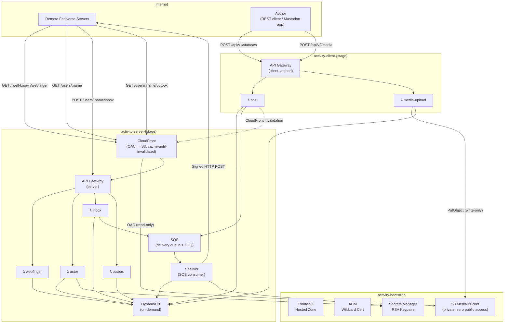
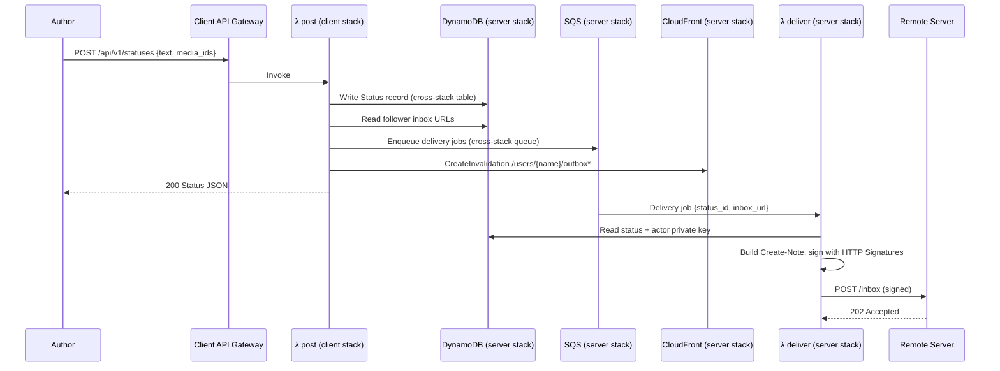
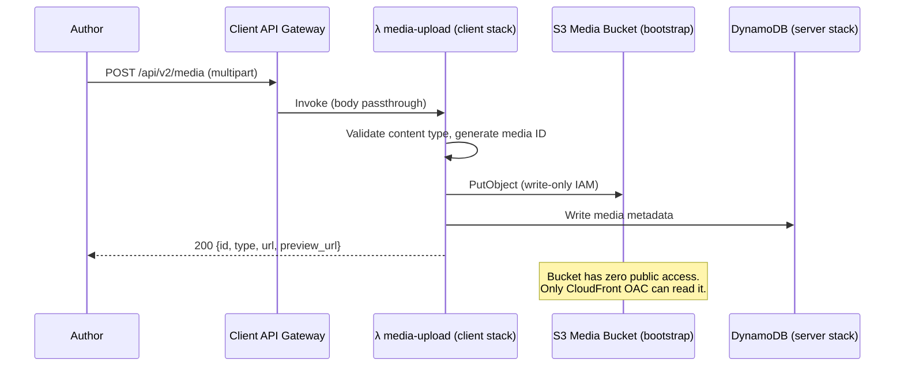
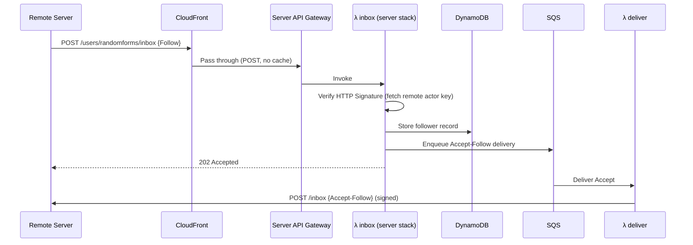

# activity.happitec.com — Project Plan

**Serverless ActivityPub for happitec-inc**

A multi-account ActivityPub server running entirely on AWS serverless infrastructure (Lambda, DynamoDB, SQS, S3, CloudFront). Swift, using `swift-aws-lambda-runtime`. No always-on servers.

## Goals

1. Host ActivityPub accounts for happitec apps (e.g. `@randomforms@happitec.com`, `@wishyouwerehere@happitec.com`)
2. Federate with Mastodon, GoToSocial, Misskey, and other ActivityPub servers
3. Post text, images, and video
4. Accept followers, deliver posts, receive likes/boosts/replies
5. Zero cost at rest — pay only when posting or receiving traffic
6. Mastodon client API compatibility (Ivory, Ice Cubes, Elk) as a stretch goal; simple REST API for posting as MVP

## Non-Goals (for now)

- Full Mastodon feature parity (polls, scheduled posts, bookmarks, filters, etc.)
- Admin/moderation UI
- User registration — accounts are provisioned via config/CLI
- Direct messages
- Relay support
- Full-text search

---

## Three-Stack Architecture

Infrastructure is split into three independently deployable SAM stacks. This follows the PPG pattern but with cleaner separation of concerns — bootstrap owns shared resources, server handles the read/federation surface, client handles writes.



### Stack Responsibilities

#### `activity-bootstrap` (manual deploy, rarely changes)

Owns long-lived shared resources that outlive any server/client deployment.

| Resource | Purpose |
|----------|---------|
| Route 53 Hosted Zone | DNS for `activity.happitec.com` + subdomains |
| ACM Wildcard Certificate | `*.activity.happitec.com` + apex |
| S3 Media Bucket | **Private, zero public access.** No bucket policy, no public ACLs, `BlockPublicAccess: true` on all four settings. Only CloudFront OAC and the client stack can touch it. |
| Secrets Manager | RSA keypairs per actor. Server reads public keys, deliver reads private keys. |

**Exports:** `HostedZoneId`, `CertificateArn`, `MediaBucketName`, `MediaBucketArn`

#### `activity-server-{stage}` (federation + read path)

The public-facing federation surface. **Read-only access to S3** via CloudFront OAC. Read + write to DynamoDB (inbox writes follower/activity records). Enqueues to SQS for outbound delivery.

| Resource | Purpose |
|----------|---------|
| CloudFront Distribution | Edge cache + OAC for S3 media. Cache-until-invalidated strategy. |
| API Gateway (REST API) | Federation endpoints |
| DynamoDB Tables | Actors, statuses, followers, activities, media metadata |
| SQS Queue + DLQ | Outbound delivery fan-out |
| λ webfinger | `GET /.well-known/webfinger` |
| λ actor | `GET /users/{username}` |
| λ inbox | `POST /users/{username}/inbox` (signature verification) |
| λ outbox | `GET /users/{username}/outbox` |
| λ deliver | SQS consumer → signed HTTP POST to remote inboxes |

**IAM principle:** Server Lambdas get `dynamodb:GetItem`, `dynamodb:Query`, `dynamodb:PutItem` (inbox only), `dynamodb:DeleteItem` (inbox only), `sqs:SendMessage`, `secretsmanager:GetSecretValue`. **Zero S3 permissions** — CloudFront OAC handles media serving.

**Imports:** bootstrap exports. **Exports:** `TableName`, `TableArn`, `QueueUrl`, `QueueArn`, `CloudFrontDistributionId`, `ServerApiUrl`

#### `activity-client-{stage}` (authoring + write path)

The only stack with S3 write access. Separate API Gateway behind auth.

| Resource | Purpose |
|----------|---------|
| API Gateway (REST API) | Authed posting endpoints |
| λ post | `POST /api/v1/statuses` — write status, enqueue delivery, invalidate CloudFront |
| λ media-upload | `POST /api/v2/media` — receive upload, PutObject to S3, write metadata to DynamoDB |

**IAM principle:** Client Lambdas get `dynamodb:PutItem`, `dynamodb:GetItem`, `dynamodb:Query`, `s3:PutObject` (media bucket), `sqs:SendMessage` (server queue), `cloudfront:CreateInvalidation` (server distribution). **No S3 read/delete.**

Media uploads flow **through the Lambda** — the client never gets a presigned URL or direct S3 access. The bucket stays dark.

**Imports:** bootstrap + server exports.

---

### CloudFront Cache Strategy

Cache-until-invalidated. The `λ post` function fires a CloudFront invalidation when content changes. Between posts, everything is served from the edge at zero compute cost.

| Path Pattern | TTL | Invalidation Trigger | Origin |
|---|---|---|---|
| `/.well-known/webfinger*` | 24h | Actor create/delete | API Gateway |
| `/users/*/outbox*` | 365d (effectively indefinite) | New post (`λ post` invalidates) | API Gateway |
| `/users/*` (GET, no /inbox) | 24h | Profile update | API Gateway |
| `/users/*/followers*` | 1h | Follow/unfollow | API Gateway |
| `/media/*` | Immutable (365d, `Cache-Control: immutable`) | Never | S3 via OAC |
| `POST /users/*/inbox` | No cache (POST passthrough) | — | API Gateway |
| `/api/*` | Not on this distribution | — | — |

The client stack's API Gateway is a **separate domain** — not behind the server's CloudFront. This keeps the public-facing CDN purely read-only.

---

### Request Flow — Posting (across stacks)



### Request Flow — Media Upload



### Request Flow — Receiving a Follow



---

## Environments

Following the PPG pattern:

| Environment | Trigger | Database | Domain |
|-------------|---------|----------|--------|
| **prod** | GitHub release (v-prefixed tag) | Dedicated tables | `activity.happitec.com` |
| **stage** | Push to main | Dedicated tables | `stage-activity.happitec.com` |
| **ephemeral** | Push to feature branch | Stage tables (shared) | `{branch}-activity.happitec.com` |

Stack names: `activity-bootstrap`, `activity-server-{stage}`, `activity-client-{stage}`.

Bootstrap is deployed once manually. Server and client stacks are deployed by CI on the same triggers.

---

## DynamoDB Schema

Single-table design. Partition key `PK`, sort key `SK`. GSI1 for reverse lookups.

| Entity | PK | SK | Attributes |
|--------|----|----|------------|
| Actor | `ACTOR#{username}` | `PROFILE` | displayName, summary, avatarUrl, headerUrl, publicKeyPem, privateKeyArn, createdAt, discoverable, manuallyApprovesFollowers |
| Status | `ACTOR#{username}` | `STATUS#{ulid}` | content, contentWarning, visibility, attachments[], inReplyTo, published, sensitive, language |
| Follower | `ACTOR#{username}` | `FOLLOWER#{actorUri}` | inboxUrl, sharedInboxUrl, followActivityId, acceptedAt |
| Received Activity | `ACTOR#{username}` | `ACTIVITY#{type}#{ulid}` | actorUri, type, objectUri, raw, receivedAt |
| Media | `MEDIA#{id}` | `META` | s3Key, contentType, blurhash, description, width, height, size |

**GSI1** (for outbox pagination, follower listing):
- GSI1PK: `ACTOR#{username}`, GSI1SK: `PUBLISHED#{iso8601}` (statuses)
- GSI1PK: `FOLLOWERS#{username}`, GSI1SK: `{acceptedAt}` (followers)

---

## Lambda Functions

All Swift, using `swift-aws-lambda-runtime` with API Gateway REST API event type. No Vapor — each function is a standalone handler.

### Server Stack — Federation Endpoints

#### `webfinger` — `GET /.well-known/webfinger`

Resolves `?resource=acct:username@happitec.com` to the actor URI.

#### `actor` — `GET /users/{username}`

Returns the ActivityPub Actor document (JSON-LD) including public key.

Response (Content-Type: `application/activity+json`):
```json
{
  "@context": [
    "https://www.w3.org/ns/activitystreams",
    "https://w3id.org/security/v1"
  ],
  "id": "https://activity.happitec.com/users/randomforms",
  "type": "Service",
  "preferredUsername": "randomforms",
  "name": "Random Forms",
  "summary": "Generative art for iOS",
  "inbox": "https://activity.happitec.com/users/randomforms/inbox",
  "outbox": "https://activity.happitec.com/users/randomforms/outbox",
  "followers": "https://activity.happitec.com/users/randomforms/followers",
  "url": "https://activity.happitec.com/@randomforms",
  "icon": {
    "type": "Image",
    "url": "https://activity.happitec.com/media/avatars/randomforms.png"
  },
  "publicKey": {
    "id": "https://activity.happitec.com/users/randomforms#main-key",
    "owner": "https://activity.happitec.com/users/randomforms",
    "publicKeyPem": "-----BEGIN PUBLIC KEY-----\n...\n-----END PUBLIC KEY-----"
  },
  "discoverable": true,
  "manuallyApprovesFollowers": false
}
```

Note: `type: "Service"` signals to other servers that this is a bot/service account, not a human. This is correct for app brand accounts.

#### `inbox` — `POST /users/{username}/inbox`

Receives activities from remote servers. Must verify HTTP Signatures.

Supported activities:
- `Follow` → store follower, enqueue `Accept` delivery
- `Undo` → if undoing `Follow`, remove follower. If undoing `Like`/`Announce`, update counts.
- `Like` → store, increment count
- `Announce` (boost) → store, increment count
- `Create` (Note, in reply) → store as reply
- `Delete` → remove stored reply/activity
- `Update` → update cached remote actor

#### `outbox` — `GET /users/{username}/outbox`

Returns an OrderedCollection of the actor's public statuses, paginated.

#### `deliver` — SQS consumer

Reads delivery jobs, constructs signed ActivityPub activities, POSTs to remote inboxes. Handles retries via SQS visibility timeout + DLQ for persistent failures.

### Client Stack — Posting Endpoints

#### `post` — `POST /api/v1/statuses`

Create a new status. Writes to DynamoDB (server stack's table), fans out delivery jobs to SQS (server stack's queue), fires CloudFront invalidation for outbox.

Auth: Bearer token (simple shared secret per actor for MVP).

#### `media-upload` — `POST /api/v2/media`

Receives multipart upload, writes to S3 (bootstrap's bucket), stores metadata in DynamoDB (server stack's table). Returns media ID for attachment to statuses.

Media flows through the Lambda — no presigned URLs, no direct S3 access from outside AWS.

---

## OpenAPI Schema

```yaml
openapi: 3.1.0
info:
  title: activity.happitec.com
  description: Serverless ActivityPub server for happitec-inc
  version: 0.1.0
  license:
    name: MIT

servers:
  - url: https://activity.happitec.com
    description: Production (server stack)
  - url: https://stage-activity.happitec.com
    description: Stage (server stack)
  - url: https://client.activity.happitec.com
    description: Production (client stack)
  - url: https://stage-client.activity.happitec.com
    description: Stage (client stack)

paths:
  # ── Server Stack (federation) ──────────────────────────

  /.well-known/webfinger:
    get:
      operationId: webfinger
      summary: WebFinger resource discovery
      tags: [federation]
      description: |
        Resolves an `acct:` URI to an ActivityPub actor.
        Required for Mastodon federation compatibility.
        Served from CloudFront cache (24h TTL).
      parameters:
        - name: resource
          in: query
          required: true
          schema:
            type: string
            example: "acct:randomforms@happitec.com"
      responses:
        "200":
          description: WebFinger JRD response
          content:
            application/jrd+json:
              schema:
                $ref: "#/components/schemas/WebFingerResponse"
        "404":
          description: Unknown resource

  /users/{username}:
    get:
      operationId: getActor
      summary: Fetch ActivityPub actor profile
      tags: [federation]
      parameters:
        - $ref: "#/components/parameters/username"
      responses:
        "200":
          description: Actor document (JSON-LD)
          content:
            application/activity+json:
              schema:
                $ref: "#/components/schemas/Actor"
        "404":
          description: Unknown actor

  /users/{username}/inbox:
    post:
      operationId: receiveActivity
      summary: Receive an ActivityPub activity
      tags: [federation]
      description: |
        Federation inbox. Receives Follow, Undo, Like, Announce,
        Create (replies), Delete, and Update activities.
        Requires valid HTTP Signature.
      parameters:
        - $ref: "#/components/parameters/username"
      requestBody:
        required: true
        content:
          application/activity+json:
            schema:
              $ref: "#/components/schemas/Activity"
          application/ld+json:
            schema:
              $ref: "#/components/schemas/Activity"
      responses:
        "202":
          description: Activity accepted
        "401":
          description: Invalid or missing HTTP Signature
        "404":
          description: Unknown actor

  /users/{username}/outbox:
    get:
      operationId: getOutbox
      summary: Fetch public statuses
      tags: [federation]
      description: |
        Returns an OrderedCollection of the actor's public posts, newest first.
        Served from CloudFront cache; invalidated on new post.
      parameters:
        - $ref: "#/components/parameters/username"
        - name: page
          in: query
          schema:
            type: boolean
        - name: min_id
          in: query
          schema:
            type: string
        - name: max_id
          in: query
          schema:
            type: string
      responses:
        "200":
          description: Ordered collection of activities
          content:
            application/activity+json:
              schema:
                $ref: "#/components/schemas/OrderedCollection"

  /users/{username}/followers:
    get:
      operationId: getFollowers
      summary: Fetch follower collection
      tags: [federation]
      parameters:
        - $ref: "#/components/parameters/username"
      responses:
        "200":
          description: Ordered collection of follower URIs
          content:
            application/activity+json:
              schema:
                $ref: "#/components/schemas/OrderedCollection"

  # ── Client Stack (authoring) ───────────────────────────

  /api/v1/statuses:
    post:
      operationId: createStatus
      summary: Post a new status
      tags: [client]
      description: |
        Creates a status and fans out delivery to all followers.
        Auth required. Mastodon-compatible subset of POST /api/v1/statuses.
        Fires CloudFront invalidation for outbox on success.
      security:
        - bearerAuth: []
      requestBody:
        required: true
        content:
          application/json:
            schema:
              $ref: "#/components/schemas/CreateStatusRequest"
          application/x-www-form-urlencoded:
            schema:
              $ref: "#/components/schemas/CreateStatusRequest"
      responses:
        "200":
          description: Status created
          content:
            application/json:
              schema:
                $ref: "#/components/schemas/Status"
        "401":
          description: Invalid or missing auth
        "422":
          description: Validation error

  /api/v2/media:
    post:
      operationId: uploadMedia
      summary: Upload media attachment
      tags: [client]
      description: |
        Upload an image or video. Media flows through the Lambda to S3 —
        no presigned URLs, no direct bucket access.
        Returns a media ID for use in createStatus.
      security:
        - bearerAuth: []
      requestBody:
        required: true
        content:
          multipart/form-data:
            schema:
              type: object
              properties:
                file:
                  type: string
                  format: binary
                  description: The media file
                description:
                  type: string
                  description: Alt text
                focus:
                  type: string
                  description: "Focal point as x,y (-1.0 to 1.0)"
      responses:
        "200":
          description: Media attachment created
          content:
            application/json:
              schema:
                $ref: "#/components/schemas/MediaAttachment"
        "401":
          description: Invalid or missing auth
        "413":
          description: File too large
        "422":
          description: Unsupported media type

components:
  securitySchemes:
    bearerAuth:
      type: http
      scheme: bearer
      description: |
        Bearer token. MVP uses per-actor shared secret stored in
        Secrets Manager. OAuth2 planned for Mastodon client compat (Phase 6).

  parameters:
    username:
      name: username
      in: path
      required: true
      schema:
        type: string
        example: randomforms

  schemas:
    WebFingerResponse:
      type: object
      properties:
        subject:
          type: string
          example: "acct:randomforms@happitec.com"
        aliases:
          type: array
          items:
            type: string
        links:
          type: array
          items:
            type: object
            properties:
              rel:
                type: string
              type:
                type: string
              href:
                type: string

    Actor:
      type: object
      description: ActivityPub Actor (Person or Service)
      properties:
        "@context":
          oneOf:
            - type: string
            - type: array
        id:
          type: string
          format: uri
        type:
          type: string
          enum: [Person, Service]
        preferredUsername:
          type: string
        name:
          type: string
        summary:
          type: string
        inbox:
          type: string
          format: uri
        outbox:
          type: string
          format: uri
        followers:
          type: string
          format: uri
        url:
          type: string
          format: uri
        icon:
          type: object
          properties:
            type:
              type: string
            url:
              type: string
              format: uri
        publicKey:
          type: object
          properties:
            id:
              type: string
            owner:
              type: string
            publicKeyPem:
              type: string
        discoverable:
          type: boolean
        manuallyApprovesFollowers:
          type: boolean

    Activity:
      type: object
      description: Generic ActivityPub activity envelope
      properties:
        "@context":
          oneOf:
            - type: string
            - type: array
        id:
          type: string
          format: uri
        type:
          type: string
          description: "Activity type: Follow, Undo, Like, Announce, Create, Delete, Update"
        actor:
          type: string
          format: uri
        object:
          description: The object of the activity (URI or inline object)
          oneOf:
            - type: string
            - type: object

    OrderedCollection:
      type: object
      properties:
        "@context":
          type: string
        id:
          type: string
          format: uri
        type:
          type: string
          enum: [OrderedCollection, OrderedCollectionPage]
        totalItems:
          type: integer
        first:
          type: string
          format: uri
        last:
          type: string
          format: uri
        orderedItems:
          type: array
          items:
            $ref: "#/components/schemas/Activity"
        next:
          type: string
          format: uri
        prev:
          type: string
          format: uri

    CreateStatusRequest:
      type: object
      properties:
        status:
          type: string
          description: Text content of the status (HTML or plain text)
        media_ids:
          type: array
          items:
            type: string
          description: Media attachment IDs from /api/v2/media
        sensitive:
          type: boolean
          default: false
        spoiler_text:
          type: string
          description: Content warning text
        visibility:
          type: string
          enum: [public, unlisted]
          default: public
        language:
          type: string
          description: ISO 639-1 language code
          example: en
        in_reply_to_id:
          type: string
          description: ID of status being replied to

    Status:
      type: object
      description: Mastodon-compatible status entity (subset)
      properties:
        id:
          type: string
        created_at:
          type: string
          format: date-time
        content:
          type: string
        visibility:
          type: string
        sensitive:
          type: boolean
        spoiler_text:
          type: string
        language:
          type: string
        uri:
          type: string
          format: uri
        url:
          type: string
          format: uri
        replies_count:
          type: integer
        reblogs_count:
          type: integer
        favourites_count:
          type: integer
        account:
          type: object
          description: Actor who posted
        media_attachments:
          type: array
          items:
            $ref: "#/components/schemas/MediaAttachment"

    MediaAttachment:
      type: object
      properties:
        id:
          type: string
        type:
          type: string
          enum: [image, video, gifv, audio, unknown]
        url:
          type: string
          format: uri
        preview_url:
          type: string
          format: uri
        description:
          type: string
        blurhash:
          type: string
        meta:
          type: object
          properties:
            width:
              type: integer
            height:
              type: integer
            size:
              type: string
```

---

## SAM Template Structure

Three templates, three stacks:

### `activity-bootstrap/template.yaml`

```
Parameters: DomainName
Resources:
  HostedZone (Route 53)
  WildcardCertificate (ACM, *.{domain} + apex)
  MediaBucket (S3):
    - BucketEncryption: AES256
    - PublicAccessBlockConfiguration: all four = true
    - No bucket policy (OAC is added by server stack)
  ActorKeys (Secrets Manager, one per actor — or dynamic)
Outputs:
  HostedZoneId, CertificateArn, MediaBucketName, MediaBucketArn
```

### `activity-server/template.yaml`

```
Parameters: Stage, BootstrapStackName
Globals:
  Function: Runtime custom.al2023, MemorySize 256, Timeout 30, Architectures arm64
Resources:
  ActorsTable (DynamoDB, on-demand, single-table)
  DeliveryQueue (SQS, visibility timeout 120s)
  DeliveryDLQ (SQS)
  CloudFrontDistribution:
    Origins:
      - API Gateway (default, for federation endpoints)
      - S3 (media, via OAC — read-only)
    CacheBehaviors:
      - /.well-known/*: TTL 24h
      - /users/*/outbox*: TTL 365d (invalidated on post)
      - /users/*/followers*: TTL 1h
      - /users/*: TTL 24h (actor profiles)
      - /media/*: TTL 365d, Cache-Control immutable
    DefaultCacheBehavior: no cache (POST passthrough)
  CloudFrontOAC (Origin Access Control for S3)
  MediaBucketPolicy (allow OAC read-only — references bootstrap bucket)
  ServerApi (API Gateway REST API):
    Routes:
      - GET /.well-known/webfinger → WebFingerFunction
      - GET /users/{username} → ActorFunction
      - POST /users/{username}/inbox → InboxFunction
      - GET /users/{username}/outbox → OutboxFunction
      - GET /users/{username}/followers → FollowersFunction
  WebFingerFunction, ActorFunction, InboxFunction, OutboxFunction, DeliverFunction
Outputs:
  TableName, TableArn, QueueUrl, QueueArn,
  CloudFrontDistributionId, ServerApiUrl, ServerDomain
```

### `activity-client/template.yaml`

```
Parameters: Stage, BootstrapStackName, ServerStackName
Globals:
  Function: Runtime custom.al2023, MemorySize 256, Timeout 60, Architectures arm64
Resources:
  ClientApi (API Gateway REST API):
    Routes:
      - POST /api/v1/statuses → PostFunction
      - POST /api/v2/media → MediaUploadFunction
  PostFunction:
    Policies:
      - DynamoDB: PutItem, GetItem, Query (server table)
      - SQS: SendMessage (server queue)
      - CloudFront: CreateInvalidation (server distribution)
      - SecretsManager: GetSecretValue (bootstrap keys)
  MediaUploadFunction:
    Policies:
      - S3: PutObject only (bootstrap media bucket)
      - DynamoDB: PutItem (server table, media metadata)
Outputs:
  ClientApiUrl
```

---

## Swift Package Structure

```
Package.swift (swift-tools-version: 6.0)
├── Sources/
│   ├── ActivityPubCore/              # Shared library (all stacks)
│   │   ├── Models/
│   │   │   ├── Actor.swift
│   │   │   ├── Activity.swift
│   │   │   ├── Note.swift
│   │   │   ├── OrderedCollection.swift
│   │   │   └── WebFingerResponse.swift
│   │   ├── Crypto/
│   │   │   ├── HTTPSignature.swift      # Sign + verify (RSA-SHA256)
│   │   │   └── KeyManager.swift         # Secrets Manager integration
│   │   ├── Storage/
│   │   │   ├── DynamoDBStore.swift
│   │   │   └── S3MediaStore.swift
│   │   └── Delivery/
│   │       └── ActivityDelivery.swift    # Build + sign + POST
│   │
│   ├── WebFingerHandler/             # Server stack
│   ├── ActorHandler/                 # Server stack
│   ├── InboxHandler/                 # Server stack
│   ├── OutboxHandler/                # Server stack
│   ├── DeliverHandler/               # Server stack (SQS consumer)
│   ├── PostHandler/                  # Client stack
│   └── MediaUploadHandler/           # Client stack
│
├── Tests/
│   └── ActivityPubCoreTests/
│       ├── HTTPSignatureTests.swift
│       ├── ActivitySerializationTests.swift
│       └── WebFingerTests.swift
│
├── activity-bootstrap/
│   └── template.yaml
├── activity-server/
│   └── template.yaml
├── activity-client/
│   └── template.yaml
├── samconfig.toml
└── Makefile                          # Build + package for Lambda
```

---

## Dependencies

| Package | Use |
|---------|-----|
| `swift-aws-lambda-runtime` | Lambda handler framework |
| `swift-aws-lambda-events` | API Gateway REST API (`APIGatewayRequest`/`APIGatewayResponse`) + SQS event types |
| `soto` (or `aws-sdk-swift`) | DynamoDB, S3, SQS, Secrets Manager, CloudFront |
| `swift-crypto` | RSA-SHA256 signing/verification |
| `swift-docc-plugin` | Documentation |

No Vapor, no Hummingbird, no HTTP framework. Each Lambda is a standalone handler.

---

## Implementation Phases

### Phase 1 — Bootstrap + read-only presence
- Deploy `activity-bootstrap` (Route 53, ACM, S3 bucket, Secrets Manager)
- Deploy `activity-server` with webfinger, actor, empty outbox
- Seed a test actor in DynamoDB with RSA keypair
- Verify Mastodon can resolve and display the profile
- **Milestone:** `@randomforms@happitec.com` shows up when searched in Mastodon

### Phase 2 — Accept followers
- Inbox handler: verify HTTP Signatures, handle Follow
- Deliver handler: send signed Accept-Follow
- **Milestone:** A Mastodon account can follow `@randomforms` and see it in their following list

### Phase 3 — Posting + delivery
- Deploy `activity-client` with post handler
- Create Note → write to DynamoDB → fan out to SQS → signed delivery
- CloudFront invalidation on post
- **Milestone:** Post appears in followers' timelines

### Phase 4 — Media
- Media-upload handler → S3 PutObject → metadata in DynamoDB
- Attach to statuses as ActivityPub `attachment` objects
- CloudFront OAC serving
- **Milestone:** Posts with images federate correctly

### Phase 5 — Interactions
- Inbox: receive and store likes, boosts, replies
- Expose counts in outbox
- **Milestone:** Full two-way federation for supported activity types

### Phase 6 (stretch) — Mastodon client API
- OAuth2 token flow (added to client stack)
- Expanded REST API for client compatibility
- **Milestone:** Post from Ivory or Ice Cubes

---

## Open Questions

1. **Handle domain:** Handles as `@name@happitec.com` requires WebFinger on `happitec.com/.well-known/webfinger`, which means either deploying to `happitec.com` or setting up a redirect/proxy from `happitec.com` to `activity.happitec.com`. The server lives at `activity.happitec.com` either way. Once federated, handles are permanent — this decision is irreversible.

2. **Auth model for posting:** Simple bearer token per actor (fast to build, stored in Secrets Manager) vs. OAuth2 from day one (needed for Mastodon client apps). Bearer token MVP means Phase 6 requires migration.

3. **`everyplace.social`:** Separate deployment or multi-domain support in the same infra? Same code, different bootstrap stack + config. ActivityPub ties actors to domains permanently, so this is also irreversible.

4. **Video handling:** Lambda payload limit is 6MB (API Gateway) / 10MB (direct invoke). Options: (a) stream through Lambda with chunked transfer, (b) two-step upload (get upload URL from Lambda, PUT directly to S3 — but this exposes S3), (c) accept the 6MB limit for MVP and add larger upload path later. Recommendation: accept the limit for MVP — most short-form video and all images fit in 6MB.

5. **HTTP Signatures vs. RFC 9421:** Mastodon 4.5+ validates both. The draft standard has wider compatibility with older servers. Build draft first, add RFC 9421 later.
