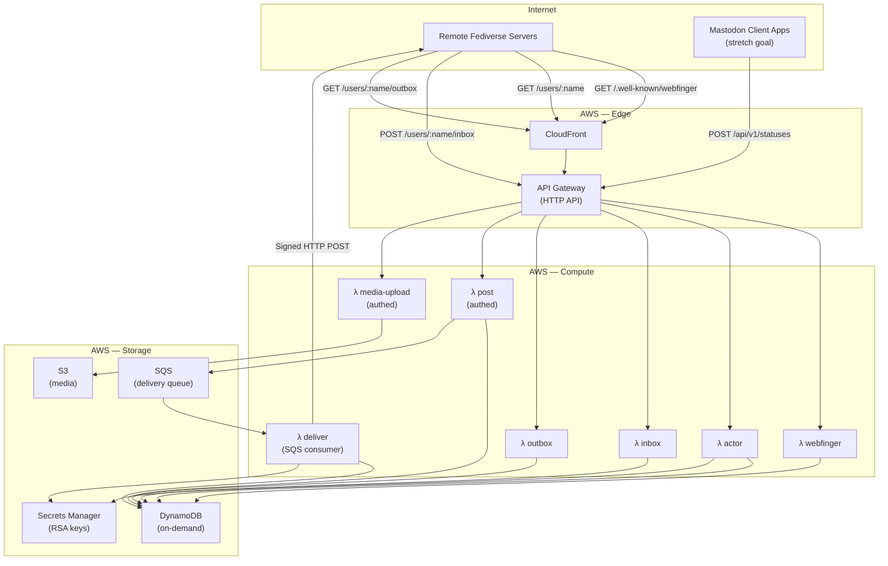
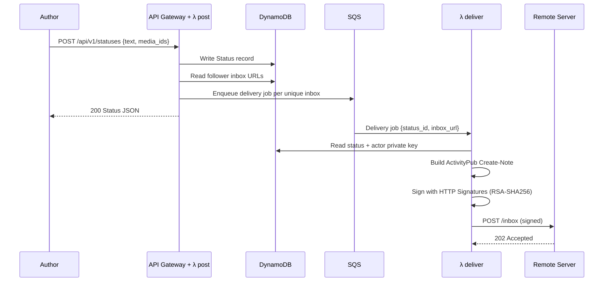
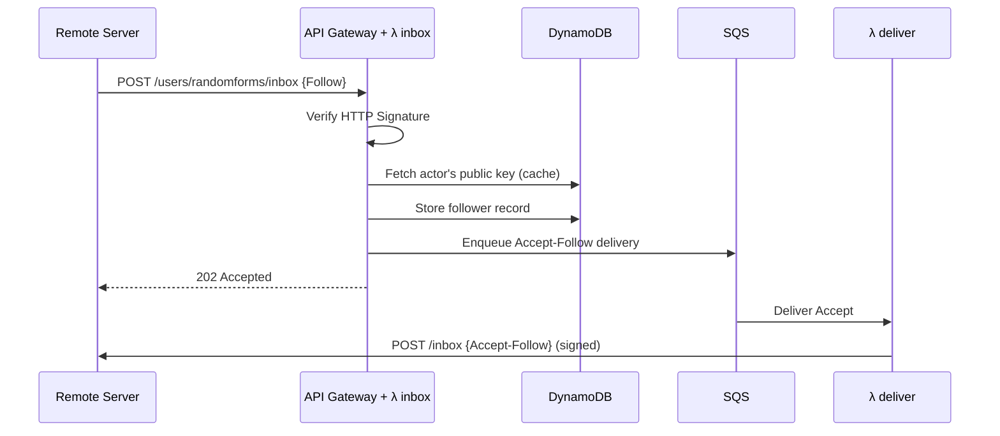

# activity.happitec.com — Project Plan

**Serverless ActivityPub for happitec-inc**

A multi-account ActivityPub server running entirely on AWS serverless infrastructure (Lambda, DynamoDB, SQS, S3, CloudFront). Swift, using `swift-aws-lambda-runtime`. No always-on servers.

## Goals

1. Host ActivityPub accounts for happitec apps (e.g. `@randomforms@happitec.com`, `@wishyouwerehere@happitec.com`)
2. Federate with Mastodon, GoToSocial, Misskey, and other ActivityPub servers
3. Post text, images, and video
4. Accept followers, deliver posts, receive likes/boosts/replies
5. Zero cost at rest — pay only when posting or receiving traffic
6. Mastodon client API compatibility (Ivory, Ice Cubes, Elk) as a stretch goal; simple REST API for posting as MVP

## Non-Goals (for now)

- Full Mastodon feature parity (polls, scheduled posts, bookmarks, filters, etc.)
- Admin/moderation UI
- User registration — accounts are provisioned via config/CLI
- Direct messages
- Relay support
- Full-text search

---

## Architecture



### Request Flow — Posting



### Request Flow — Receiving a Follow



---

## Environments

Following the PPG pattern:

| Environment | Trigger | Database | Domain |
|-------------|---------|----------|--------|
| **prod** | GitHub release (v-prefixed tag) | Dedicated tables | `activity.happitec.com` |
| **stage** | Push to main | Dedicated tables | `stage-activity.happitec.com` |
| **ephemeral** | Push to feature branch | Stage tables (shared) | `{branch}-activity.happitec.com` |

SAM template with `Stage` parameter. CloudFormation stacks: `activity-{stage}`.

---

## DynamoDB Schema

Single-table design. Partition key `PK`, sort key `SK`. GSI1 for reverse lookups.

| Entity | PK | SK | Attributes |
|--------|----|----|------------|
| Actor | `ACTOR#{username}` | `PROFILE` | displayName, summary, avatarUrl, headerUrl, publicKeyPem, privateKeyArn, createdAt, discoverable, manuallyApprovesFollowers |
| Status | `ACTOR#{username}` | `STATUS#{ulid}` | content, contentWarning, visibility, attachments[], inReplyTo, published, sensitive, language |
| Follower | `ACTOR#{username}` | `FOLLOWER#{actorUri}` | inboxUrl, sharedInboxUrl, followActivityId, acceptedAt |
| Received Activity | `ACTOR#{username}` | `ACTIVITY#{type}#{ulid}` | actorUri, type, objectUri, raw, receivedAt |
| Media | `MEDIA#{id}` | `META` | s3Key, contentType, blurhash, description, width, height, size |

**GSI1** (for outbox pagination, follower listing):
- GSI1PK: `ACTOR#{username}`, GSI1SK: `PUBLISHED#{iso8601}` (statuses)
- GSI1PK: `FOLLOWERS#{username}`, GSI1SK: `{acceptedAt}` (followers)

---

## Lambda Functions

All Swift, using `swift-aws-lambda-runtime` with API Gateway HTTP API event type. No Vapor — each function is a standalone handler.

### Federation Endpoints (ActivityPub)

#### `webfinger` — `GET /.well-known/webfinger`

Resolves `?resource=acct:username@happitec.com` to the actor URI.

**Cacheable:** Yes — CloudFront, long TTL. Invalidate on actor create/delete only.

#### `actor` — `GET /users/{username}`

Returns the ActivityPub Actor document (JSON-LD) including public key.

Response (Content-Type: `application/activity+json`):
```json
{
  "@context": [
    "https://www.w3.org/ns/activitystreams",
    "https://w3id.org/security/v1"
  ],
  "id": "https://activity.happitec.com/users/randomforms",
  "type": "Service",
  "preferredUsername": "randomforms",
  "name": "Random Forms",
  "summary": "Generative art for iOS",
  "inbox": "https://activity.happitec.com/users/randomforms/inbox",
  "outbox": "https://activity.happitec.com/users/randomforms/outbox",
  "followers": "https://activity.happitec.com/users/randomforms/followers",
  "url": "https://activity.happitec.com/@randomforms",
  "icon": {
    "type": "Image",
    "url": "https://media.happitec.com/avatars/randomforms.png"
  },
  "publicKey": {
    "id": "https://activity.happitec.com/users/randomforms#main-key",
    "owner": "https://activity.happitec.com/users/randomforms",
    "publicKeyPem": "-----BEGIN PUBLIC KEY-----\n...\n-----END PUBLIC KEY-----"
  },
  "discoverable": true,
  "manuallyApprovesFollowers": false
}
```

**Cacheable:** Yes — CloudFront, moderate TTL. Invalidate on profile update.

Note: `type: "Service"` signals to other servers that this is a bot/service account, not a human. This is correct for app brand accounts.

#### `inbox` — `POST /users/{username}/inbox`

Receives activities from remote servers. Must verify HTTP Signatures.

Supported activities:
- `Follow` → store follower, enqueue `Accept` delivery
- `Undo` → if undoing `Follow`, remove follower. If undoing `Like`/`Announce`, update counts.
- `Like` → store, increment count
- `Announce` (boost) → store, increment count
- `Create` (Note, in reply) → store as reply
- `Delete` → remove stored reply/activity
- `Update` → update cached remote actor

**Not cacheable.**

#### `outbox` — `GET /users/{username}/outbox`

Returns an OrderedCollection of the actor's public statuses, paginated.

**Cacheable:** Yes — short TTL (5 min). Invalidate on new post.

### Posting API (Authed)

#### `post` — `POST /api/v1/statuses`

Create a new status. Writes to DynamoDB, fans out delivery jobs to SQS.

Auth: Bearer token (simple shared secret per actor, or OAuth2 later for Mastodon client compat).

#### `media-upload` — `POST /api/v2/media`

Upload media. Returns a presigned S3 URL or accepts multipart upload. Stores metadata in DynamoDB. Returns a media ID for attachment to a status.

### Internal

#### `deliver` — SQS consumer

Reads delivery jobs, constructs signed ActivityPub activities, POSTs to remote inboxes. Handles retries (SQS visibility timeout + DLQ for persistent failures).

---

## OpenAPI Schema

```yaml
openapi: 3.1.0
info:
  title: activity.happitec.com
  description: Serverless ActivityPub server for happitec-inc
  version: 0.1.0
  license:
    name: MIT

servers:
  - url: https://activity.happitec.com
    description: Production
  - url: https://stage-activity.happitec.com
    description: Stage

paths:
  /.well-known/webfinger:
    get:
      operationId: webfinger
      summary: WebFinger resource discovery
      description: |
        Resolves an `acct:` URI to an ActivityPub actor.
        Required for Mastodon federation compatibility.
      parameters:
        - name: resource
          in: query
          required: true
          schema:
            type: string
            example: "acct:randomforms@happitec.com"
      responses:
        "200":
          description: WebFinger JRD response
          content:
            application/jrd+json:
              schema:
                $ref: "#/components/schemas/WebFingerResponse"
        "404":
          description: Unknown resource

  /users/{username}:
    get:
      operationId: getActor
      summary: Fetch ActivityPub actor profile
      parameters:
        - $ref: "#/components/parameters/username"
      responses:
        "200":
          description: Actor document
          content:
            application/activity+json:
              schema:
                $ref: "#/components/schemas/Actor"
        "404":
          description: Unknown actor

  /users/{username}/inbox:
    post:
      operationId: receiveActivity
      summary: Receive an ActivityPub activity
      description: |
        Federation inbox. Receives Follow, Undo, Like, Announce,
        Create (replies), Delete, and Update activities.
        Requires valid HTTP Signature.
      parameters:
        - $ref: "#/components/parameters/username"
      requestBody:
        required: true
        content:
          application/activity+json:
            schema:
              $ref: "#/components/schemas/Activity"
          application/ld+json:
            schema:
              $ref: "#/components/schemas/Activity"
      responses:
        "202":
          description: Activity accepted
        "401":
          description: Invalid or missing HTTP Signature
        "404":
          description: Unknown actor

  /users/{username}/outbox:
    get:
      operationId: getOutbox
      summary: Fetch public statuses
      description: Returns an OrderedCollection of the actor's public posts, newest first.
      parameters:
        - $ref: "#/components/parameters/username"
        - name: page
          in: query
          schema:
            type: boolean
        - name: min_id
          in: query
          schema:
            type: string
        - name: max_id
          in: query
          schema:
            type: string
      responses:
        "200":
          description: Ordered collection of activities
          content:
            application/activity+json:
              schema:
                $ref: "#/components/schemas/OrderedCollection"

  /users/{username}/followers:
    get:
      operationId: getFollowers
      summary: Fetch follower collection
      parameters:
        - $ref: "#/components/parameters/username"
      responses:
        "200":
          description: Ordered collection of follower URIs
          content:
            application/activity+json:
              schema:
                $ref: "#/components/schemas/OrderedCollection"

  /api/v1/statuses:
    post:
      operationId: createStatus
      summary: Post a new status
      description: |
        Creates a status and fans out delivery to all followers.
        Auth required. Mastodon-compatible subset of POST /api/v1/statuses.
      security:
        - bearerAuth: []
      requestBody:
        required: true
        content:
          application/json:
            schema:
              $ref: "#/components/schemas/CreateStatusRequest"
          application/x-www-form-urlencoded:
            schema:
              $ref: "#/components/schemas/CreateStatusRequest"
      responses:
        "200":
          description: Status created
          content:
            application/json:
              schema:
                $ref: "#/components/schemas/Status"
        "401":
          description: Invalid or missing auth
        "422":
          description: Validation error

  /api/v2/media:
    post:
      operationId: uploadMedia
      summary: Upload media attachment
      description: |
        Upload an image or video. Returns a media ID for use in createStatus.
      security:
        - bearerAuth: []
      requestBody:
        required: true
        content:
          multipart/form-data:
            schema:
              type: object
              properties:
                file:
                  type: string
                  format: binary
                  description: The media file
                description:
                  type: string
                  description: Alt text
                focus:
                  type: string
                  description: "Focal point as x,y (-1.0 to 1.0)"
      responses:
        "200":
          description: Media attachment created
          content:
            application/json:
              schema:
                $ref: "#/components/schemas/MediaAttachment"
        "401":
          description: Invalid or missing auth
        "422":
          description: Unsupported media type

components:
  securitySchemes:
    bearerAuth:
      type: http
      scheme: bearer
      description: Bearer token. MVP uses per-actor shared secret. OAuth2 planned for Mastodon client compat.

  parameters:
    username:
      name: username
      in: path
      required: true
      schema:
        type: string
        example: randomforms

  schemas:
    WebFingerResponse:
      type: object
      properties:
        subject:
          type: string
          example: "acct:randomforms@happitec.com"
        aliases:
          type: array
          items:
            type: string
        links:
          type: array
          items:
            type: object
            properties:
              rel:
                type: string
              type:
                type: string
              href:
                type: string

    Actor:
      type: object
      description: ActivityPub Actor (Person or Service)
      properties:
        "@context":
          oneOf:
            - type: string
            - type: array
        id:
          type: string
          format: uri
        type:
          type: string
          enum: [Person, Service]
        preferredUsername:
          type: string
        name:
          type: string
        summary:
          type: string
        inbox:
          type: string
          format: uri
        outbox:
          type: string
          format: uri
        followers:
          type: string
          format: uri
        url:
          type: string
          format: uri
        icon:
          type: object
          properties:
            type:
              type: string
            url:
              type: string
              format: uri
        publicKey:
          type: object
          properties:
            id:
              type: string
            owner:
              type: string
            publicKeyPem:
              type: string
        discoverable:
          type: boolean
        manuallyApprovesFollowers:
          type: boolean

    Activity:
      type: object
      description: Generic ActivityPub activity envelope
      properties:
        "@context":
          oneOf:
            - type: string
            - type: array
        id:
          type: string
          format: uri
        type:
          type: string
          description: "Activity type: Follow, Undo, Like, Announce, Create, Delete, Update"
        actor:
          type: string
          format: uri
        object:
          description: The object of the activity (URI or inline object)
          oneOf:
            - type: string
            - type: object

    OrderedCollection:
      type: object
      properties:
        "@context":
          type: string
        id:
          type: string
          format: uri
        type:
          type: string
          enum: [OrderedCollection, OrderedCollectionPage]
        totalItems:
          type: integer
        first:
          type: string
          format: uri
        last:
          type: string
          format: uri
        orderedItems:
          type: array
          items:
            $ref: "#/components/schemas/Activity"
        next:
          type: string
          format: uri
        prev:
          type: string
          format: uri

    CreateStatusRequest:
      type: object
      properties:
        status:
          type: string
          description: Text content of the status (HTML or plain text)
        media_ids:
          type: array
          items:
            type: string
          description: Media attachment IDs from /api/v2/media
        sensitive:
          type: boolean
          default: false
        spoiler_text:
          type: string
          description: Content warning text
        visibility:
          type: string
          enum: [public, unlisted]
          default: public
        language:
          type: string
          description: ISO 639-1 language code
          example: en
        in_reply_to_id:
          type: string
          description: ID of status being replied to

    Status:
      type: object
      description: Mastodon-compatible status entity (subset)
      properties:
        id:
          type: string
        created_at:
          type: string
          format: date-time
        content:
          type: string
        visibility:
          type: string
        sensitive:
          type: boolean
        spoiler_text:
          type: string
        language:
          type: string
        uri:
          type: string
          format: uri
        url:
          type: string
          format: uri
        replies_count:
          type: integer
        reblogs_count:
          type: integer
        favourites_count:
          type: integer
        account:
          type: object
          description: Actor who posted
        media_attachments:
          type: array
          items:
            $ref: "#/components/schemas/MediaAttachment"

    MediaAttachment:
      type: object
      properties:
        id:
          type: string
        type:
          type: string
          enum: [image, video, gifv, audio, unknown]
        url:
          type: string
          format: uri
        preview_url:
          type: string
          format: uri
        description:
          type: string
        blurhash:
          type: string
        meta:
          type: object
          properties:
            width:
              type: integer
            height:
              type: integer
            size:
              type: string
```

---

## SAM Template Structure

```
template.yaml
├── Parameters: Stage, DomainName, CertificateArn
├── Conditions: IsProd, IsStage
├── Globals:
│   └── Function: Runtime custom.al2023, MemorySize 256, Timeout 30, Architectures arm64
│
├── Resources:
│   ├── ActorsTable (DynamoDB, on-demand)
│   ├── DeliveryQueue (SQS, with DLQ)
│   ├── MediaBucket (S3)
│   ├── CloudFrontDistribution
│   │   ├── Origin: API Gateway (default)
│   │   ├── Origin: S3 (media)
│   │   ├── CacheBehavior: /.well-known/* → long TTL
│   │   ├── CacheBehavior: /users/* GET → moderate TTL
│   │   ├── CacheBehavior: /media/* → immutable
│   │   └── Default: no cache (POST passthrough)
│   │
│   ├── WebFingerFunction (Lambda)
│   ├── ActorFunction (Lambda)
│   ├── InboxFunction (Lambda)
│   ├── OutboxFunction (Lambda)
│   ├── PostFunction (Lambda)
│   ├── MediaUploadFunction (Lambda)
│   ├── DeliverFunction (Lambda, SQS event source)
│   │
│   └── HttpApi (API Gateway HTTP API, routes → functions)
│
└── Outputs: ApiUrl, CloudFrontDomain, MediaBucket
```

---

## Swift Package Structure

```
Package.swift (swift-tools-version: 6.0)
├── Sources/
│   ├── ActivityPubCore/           # Shared library
│   │   ├── Models/
│   │   │   ├── Actor.swift
│   │   │   ├── Activity.swift
│   │   │   ├── Note.swift
│   │   │   ├── OrderedCollection.swift
│   │   │   └── WebFingerResponse.swift
│   │   ├── Crypto/
│   │   │   ├── HTTPSignature.swift     # Sign + verify
│   │   │   └── KeyManager.swift        # Secrets Manager integration
│   │   ├── Storage/
│   │   │   ├── DynamoDBStore.swift
│   │   │   └── S3MediaStore.swift
│   │   └── Delivery/
│   │       └── ActivityDelivery.swift   # Build + sign + POST
│   │
│   ├── WebFingerHandler/          # Lambda: GET /.well-known/webfinger
│   ├── ActorHandler/              # Lambda: GET /users/{username}
│   ├── InboxHandler/              # Lambda: POST /users/{username}/inbox
│   ├── OutboxHandler/             # Lambda: GET /users/{username}/outbox
│   ├── PostHandler/               # Lambda: POST /api/v1/statuses
│   ├── MediaUploadHandler/        # Lambda: POST /api/v2/media
│   └── DeliverHandler/            # Lambda: SQS consumer
│
├── Tests/
│   └── ActivityPubCoreTests/
│       ├── HTTPSignatureTests.swift
│       ├── ActivitySerializationTests.swift
│       └── WebFingerTests.swift
│
├── template.yaml                  # SAM
├── samconfig.toml
└── Makefile                       # Build + package for Lambda
```

---

## Dependencies

| Package | Use |
|---------|-----|
| `swift-aws-lambda-runtime` | Lambda handler framework |
| `swift-aws-lambda-events` | API Gateway + SQS event types |
| `soto` (or `aws-sdk-swift`) | DynamoDB, S3, SQS, Secrets Manager |
| `swift-crypto` | RSA-SHA256 signing/verification |
| `swift-docc-plugin` | Documentation |

No Vapor, no Hummingbird, no HTTP framework. Each Lambda is a standalone handler.

---

## Implementation Phases

### Phase 1 — Federation (read-only presence)
- WebFinger, Actor profile, empty Outbox
- Deploy to stage, verify Mastodon can resolve and display the profile
- **Milestone:** `@randomforms@activity.happitec.com` shows up when searched in Mastodon

### Phase 2 — Accept followers
- Inbox: handle Follow + verify HTTP Signatures
- Deliver Accept-Follow responses
- **Milestone:** A Mastodon account can follow `@randomforms` and see it in their following list

### Phase 3 — Posting + delivery
- POST /api/v1/statuses → create Note → fan out to followers
- SQS delivery with signed HTTP POSTs
- **Milestone:** Post appears in followers' timelines

### Phase 4 — Media
- Image/video upload to S3
- Attach to statuses
- CloudFront serving
- **Milestone:** Posts with images federate correctly

### Phase 5 — Interactions
- Receive and store likes, boosts, replies
- Expose counts in outbox
- **Milestone:** Full two-way federation for the supported activity types

### Phase 6 (stretch) — Mastodon client API
- OAuth2 token flow
- Expanded REST API for client compatibility
- **Milestone:** Post from Ivory or Ice Cubes

---

## Open Questions

1. **Domain:** `activity.happitec.com` vs `social.happitec.com` vs hosting on `happitec.com` itself? WebFinger supports different domains for the handle vs. the server, so `@randomforms@happitec.com` can resolve to `activity.happitec.com/users/randomforms`. Once federated, this is permanent.

2. **Auth model for posting:** Simple bearer token per actor (fast to build) vs. OAuth2 from day one (needed for Mastodon client apps)? Bearer token MVP means Phase 6 requires a migration.

3. **`everyplace.social`:** Separate instance or same infrastructure with multi-domain support? ActivityPub is one-domain-per-actor but the server can host actors on multiple domains if WebFinger is configured per domain.

4. **Video processing:** Accept raw uploads and serve as-is, or transcode? Lambda has a 6MB/10MB payload limit — large uploads need S3 presigned URLs or transfer acceleration.

5. **HTTP Signatures vs. RFC 9421:** Mastodon 4.5+ supports both. Build the old draft standard first (wider compat) and add RFC 9421 later?
